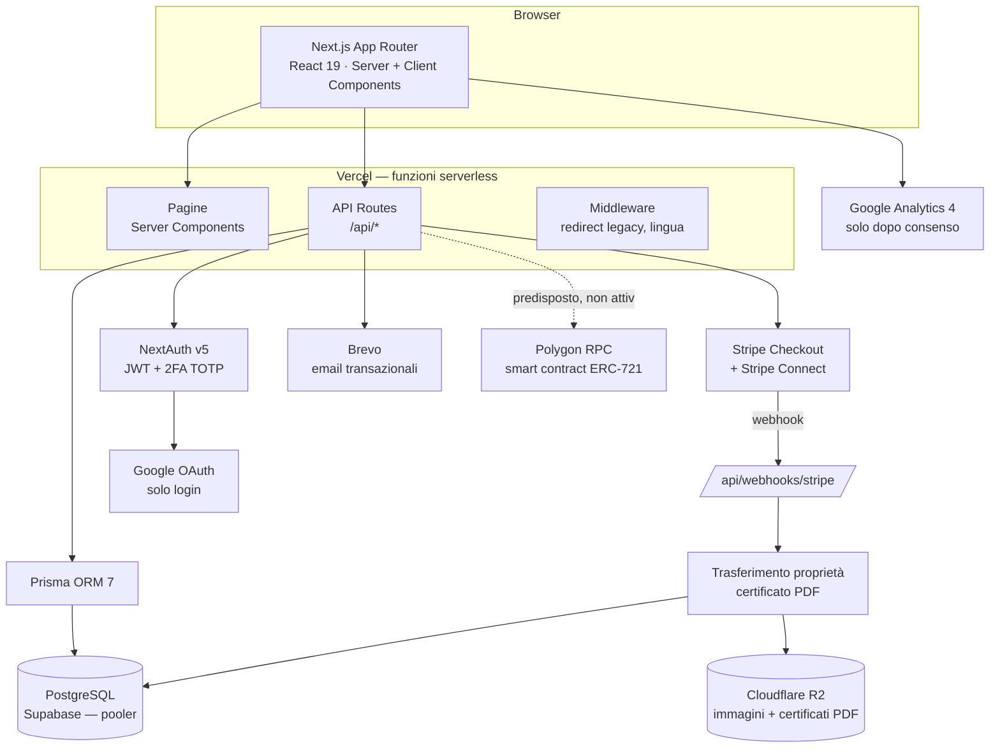
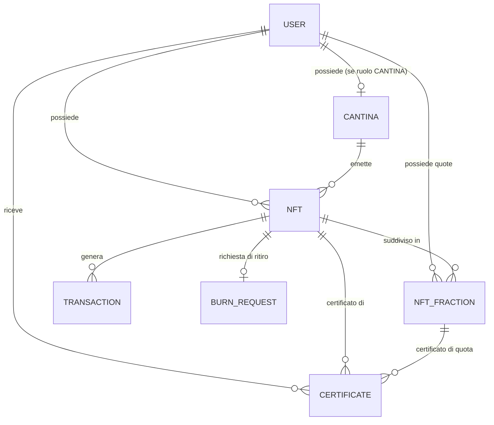

# Wine Bank 24 — Infrastruttura, Sicurezza e Scalabilità

> Documento tecnico per lo sviluppatore. Descrive cosa è stato costruito, con quali
> tecnologie, su quali server è ospitato, e valuta lo stato di sicurezza e scalabilità
> della piattaforma così com'è oggi — non un piano futuro, una fotografia dello stato reale.

**Data:** 31 agosto 2026 (aggiornato dopo l'introduzione di test, CI, monitoraggio e staging)
**Repository:** `dcmediasrl-lang/winebank24` · **Branch:** `main`
**Produzione:** `https://app.winebank24.eu`

---

## 1. Panoramica architetturale

Applicazione **monolitica** Next.js: frontend (pagine React) e backend (API route) vivono
nello stesso progetto e nello stesso deployment. Non c'è un backend separato, non c'è
microservizi: ogni richiesta HTTP viene gestita da una funzione serverless su Vercel, che
al bisogno interroga direttamente il database Postgres o i servizi esterni.

Non esiste una coda di job, un worker separato, o un layer di cache (Redis, ecc.): ogni
operazione — incluse quelle più pesanti come la generazione di un PDF con QR code ed
embedding immagine — avviene in linea, dentro la stessa richiesta HTTP che l'ha innescata.

---

## 2. Stack tecnologico

| Area | Tecnologia | Versione | Note |
|---|---|---|---|
| Framework | Next.js (App Router) | 16.2.6 | Breaking change importanti rispetto alle versioni precedenti — vedi `AGENTS.md` |
| Linguaggio | TypeScript | ^5 | Strict mode, nessun `any` implicito tollerato dal linter |
| UI | React | 19.2.4 | Server Components come default, Client Components solo dove serve interattività |
| Stile | Tailwind CSS | ^4 | Utility-first, nessun CSS-in-JS |
| Componenti UI | `@base-ui/react`, `shadcn` (pattern, non dipendenza runtime) | — | |
| ORM | Prisma | ^7.8.0 | Client generato da `prisma/schema.prisma`, adapter `@prisma/adapter-pg` |
| Database | PostgreSQL (Supabase, gestito) | — | Connessione via **session pooler** (porta 5432), non connessione diretta |
| Autenticazione | NextAuth (Auth.js) | ^5.0.0-beta.31 | **Versione beta** — comportamenti cambiati durante lo sviluppo (vedi §6.9) |
| Password hashing | bcryptjs | ^3.0.3 | Cost factor 12 |
| 2FA | otplib | ^13.4.0 | TOTP standard, compatibile Google Authenticator |
| Pagamenti | Stripe (server + client SDK) | stripe ^22 / @stripe/stripe-js ^9 | Checkout hosted + Stripe Connect per lo split automatico |
| Storage oggetti | Cloudflare R2 (`@aws-sdk/client-s3`) | ^3 | S3-compatibile, bucket pubblico in lettura |
| Email transazionali | Brevo (ex Sendinblue), via API REST | — | Nessun SDK, chiamata `fetch` diretta |
| PDF | pdf-lib | ^1.17.1 | Contratti cantina e certificati di proprietà, generati a runtime |
| QR code | qrcode | ^1.5.4 | Generato server-side, sia per 2FA sia per i certificati |
| Blockchain (non attiva) | ethers.js, Solidity + OpenZeppelin, Hardhat | ethers ^6 | Contratto ERC-721 scritto e compilabile, mai deployato in produzione |
| Validazione | zod | ^4 | Su tutti gli endpoint API che accettano input utente |
| Stato client | zustand, `@tanstack/react-query` | — | |
| Hosting | Vercel | — | Deploy da CLI, funzioni serverless |
| Analytics | Google Analytics 4 (`@next/third-parties`) | — | Caricato solo dopo consenso cookie |
| Test | Vitest | ^4 | `npm test` — `src/**/*.test.ts` |
| CI | GitHub Actions | — | `.github/workflows/ci.yml` |
| Monitoraggio errori | Sentry (`@sentry/nextjs`) | ^10 | Server, client e route handler |

---

## 3. Hosting e infrastruttura

Nessun server gestito manualmente: tutto è infrastruttura **serverless / managed** di terze
parti.

| Servizio | Ruolo | Piano/regione | Note operative |
|---|---|---|---|
| **Vercel** | Hosting, build, funzioni serverless, CDN statico | Team `dcmedia-s-projects` | Deploy manuale via CLI (`vercel deploy --prod` per produzione, `vercel deploy` per staging) — il repository non è collegato all'integrazione Git di Vercel, quindi non ci sono deploy automatici su push; il controllo automatico prima del merge lo fa GitHub Actions (vedi sotto), non Vercel |
| **Supabase — produzione** | PostgreSQL gestito | `aws-0-eu-west-3` (Parigi) | Si usa il **session pooler** (host `aws-0-eu-west-3.pooler.supabase.com:5432`); la stringa di connessione "diretta" richiede IPv6 e non funziona da ogni rete — motivo per cui si usa sempre il pooler |
| **Supabase — staging** | PostgreSQL separato per l'ambiente di anteprima | `aws-1-eu-west-3` (Parigi), progetto `winebank24-staging` | Stesso schema, dati indipendenti. `DATABASE_URL` è impostata **solo** sull'ambiente "Preview" di Vercel — mai condivisa con produzione |
| **GitHub Actions** | CI: type-check, lint, test | — | `.github/workflows/ci.yml`, ad ogni push/PR su `main`. Non esegue `next build` (richiederebbe i segreti di produzione come variabili GitHub, scelta non ancora presa) |
| **Sentry** | Monitoraggio errori applicativi | Org `dcmediasrl` | Attivo solo in produzione (`SENTRY_DSN` non impostata su staging/locale) |
| **Cloudflare R2** | Storage oggetti (immagini bottiglie, PDF contratti e certificati) | — | Bucket con accesso pubblico in lettura; le chiavi sono UUID casuali (non enumerabili), non c'è un vero controllo d'accesso |
| **Stripe** | Pagamenti, split automatico (Connect) | — | **Chiavi di test**, non ancora passate a chiavi live |
| **Brevo** | Invio email transazionali | — | API key in variabile d'ambiente, nessun dominio di invio dedicato verificato al momento della scrittura |
| **Google Cloud (OAuth)** | Login social (solo accesso, mai registrazione) | — | |
| **Google Analytics 4** | Statistiche di traffico | — | |
| **Polygon (RPC)** | Blockchain, predisposta e non attiva | — | Variabili d'ambiente presenti ma non valorizzate in produzione |

**Variabili d'ambiente**: mai committate (`.env` è in `.gitignore`); il modello con i soli
nomi delle chiavi è in `.env.example`. Per allineare l'ambiente locale a produzione si usa
`npx vercel env pull .env`.

**Dominio e DNS**: `app.winebank24.eu`, gestito come alias Vercel del progetto.

---

## 4. Modello dei dati (sintesi)

Schema Prisma con **22 modelli**. I principali:

- `User` — un solo modello per tutti i ruoli (`ADMIN`, `CANTINA`, `COLLECTOR`), distinti da
  un campo `role`. Include anagrafica KYC, stato di sicurezza (tentativi falliti, 2FA,
  blocco), consenso contrattuale, `deletedAt` per l'anonimizzazione GDPR.
- `Cantina` — profilo pubblico, dati contrattuali, `insuranceDocUrl`, `stripeAccountId`.
- `Nft` — il certificato: dati della bottiglia, stato (`NftStatus`), `certificateVersion`
  (si incrementa a ogni cessione o riscatto — vedi §6).
- `NftFraction` — comproprietà frazionata, con la propria `certificateVersion`.
- `Certificate` — il certificato PDF emesso: seriale univoco, versione, URL del file,
  collegato a un NFT o a una quota.
- `Transaction`, `Offer`, `BurnRequest` — il ciclo di vita di una compravendita o di un
  riscatto fisico.
- `ActivityLog`, `RateLimit` — sicurezza operativa (vedi §6).

Diagramma ER semplificato:

---

## 5. Processo di deploy

1. Sviluppo in locale (`npm run dev`). **Punto da correggere**: il database usato in
   locale è ancora quello di produzione, non lo staging — l'ambiente di staging esiste
   oggi solo per i deploy Vercel di anteprima, non per lo sviluppo quotidiano.
2. `npm test` e `npx tsc --noEmit` in locale prima di proporre una modifica (la stessa
   cosa gira automaticamente su GitHub Actions ad ogni push, vedi sotto).
3. `npx prisma db push` per applicare eventuali modifiche allo schema (non si usano
   migration file versionate: `prisma db push` sincronizza lo schema direttamente,
   approccio adatto a un progetto in fase iniziale ma da rivedere quando il numero di
   sviluppatori o la criticità dei dati cresce). Va lanciato a mano sia su produzione sia
   sullo staging quando lo schema cambia — non è automatizzato.
4. `git commit` + `git push` su GitHub → **GitHub Actions** esegue type-check, lint e test.
5. Facoltativo: `npx vercel deploy` (senza `--prod`) per un deploy di anteprima sul
   database di staging, protetto da login Vercel.
6. `npx vercel deploy --prod` — deploy di produzione, manuale.
7. Verifica manuale in produzione dopo ogni deploy (ora affiancata da Sentry per gli
   errori che sfuggono al controllo manuale).

**Non esiste ancora**: un build gate che impedisca il deploy in produzione se la CI su
GitHub è rossa — le due cose (push su GitHub e `vercel deploy --prod`) restano comandi
separati, è responsabilità di chi fa il deploy controllare che la CI sia passata prima.

---

## 6. Sicurezza

### 6.1 Autenticazione
- Password hash con bcrypt (cost 12).
- Sessione JWT con durata **7 giorni** (non i 30 di default di NextAuth) — scelta
  deliberata per ridurre la finestra di rischio di un token rubato su una piattaforma con
  pagamenti.
- **Verifica email obbligatoria al login**: introdotta durante questa fase di sviluppo dopo
  aver scoperto che si poteva accedere con un'email mai verificata, anche inesistente —
  bastava conoscere la password (`src/lib/auth.ts`).
- **2FA TOTP opzionale**, compatibile con app di autenticazione standard.
- Blocco account dopo 5 tentativi falliti (30 minuti), tracciato per singolo utente.
- **Login con Google limitato all'accesso**: non crea mai un nuovo account, accetta solo
  chi si è già registrato con email e password.

### 6.2 Autorizzazione
- Basata su ruolo (`ADMIN` / `CANTINA` / `COLLECTOR`), verificata **per singola API route**
  chiamando `auth()` e controllando `session.user.role` — non c'è un middleware centrale
  che applichi le regole di autorizzazione a tutte le route (il middleware attuale gestisce
  solo redirect, non permessi).
- Gate lato server per l'accesso all'area cantina: contratto non accettato → redirect
  forzato, verificato con lettura diretta dal database (non da un flag nel JWT, che si è
  dimostrato inaffidabile in un caso simile durante lo sviluppo del flusso Google).

### 6.3 Pagamenti e trasferimento di proprietà
- **Nessun trasferimento di proprietà avviene fuori dal webhook Stripe**, dopo conferma
  `checkout.session.completed`. Offerte accettate, acquisti diretti e cessioni di quote
  passano tutti da lì.
- **Idempotenza**: il webhook verifica che lo `stripeId` non sia già stato processato prima
  di agire — Stripe può recapitare lo stesso evento più volte.
- **Anti doppia-vendita**: prima di trasferire un NFT intero, si verifica che il venditore
  lo possieda ancora al momento del pagamento (può non essere più vero se due offerte sullo
  stesso bene sono state accettate).
- Split automatico degli incassi via Stripe Connect (`application_fee_amount` +
  `transfer_data.destination`), quando la cantina ha collegato il proprio account.

### 6.4 Validazione input e protezione API
- Validazione con `zod` su tutti gli endpoint che accettano input utente.
- Rate limiting basato su database (tabella `RateLimit`) su azioni sensibili (login,
  checkout, registrazione) — **fail-open dichiarato**: se il database non risponde, il
  limite non viene applicato, per non bloccare l'intera piattaforma per un problema di
  infrastruttura secondario. Compromesso accettabile solo finché il traffico resta basso.

### 6.5 Header di sicurezza (applicati globalmente, `next.config.ts`)
`X-Frame-Options: SAMEORIGIN` (anti clickjacking) · `X-Content-Type-Options: nosniff` ·
`Referrer-Policy: strict-origin-when-cross-origin` · `Permissions-Policy` (nega
fotocamera/microfono/geolocalizzazione/pagamenti nativi) ·
`Strict-Transport-Security` (HSTS, 2 anni, preload) · `Cross-Origin-Opener-Policy:
same-origin`.

### 6.6 Certificati di proprietà — verifica, non revoca
Un certificato PDF scaricato non può essere invalidato da remoto (nessuno può cancellare un
file già salvato sul computer di un collezionista). La piattaforma quindi non prova a
revocarlo: ogni bottiglia/quota porta un contatore di versione (`certificateVersion`) che si
incrementa a ogni cessione o riscatto, e la pagina pubblica di verifica
(`/certificato/[seriale]`) confronta la versione stampata sul certificato con quella
corrente — segnalando "non più valido" senza mai esporre l'identità del proprietario
attuale.

### 6.7 Gestione dei segreti
Tutte le credenziali (Stripe, Google, database, R2, email, wallet blockchain) vivono in
variabili d'ambiente, mai nel codice. `.env` è escluso da git. Nessun secrets manager
dedicato (es. Vercel encrypted env vars sono usate come unico livello).

### 6.8 GDPR e privacy
- **Diritto alla cancellazione** (art. 17): anonimizzazione, non delete fisico — i dati
  contabili restano per l'obbligo di conservazione decennale (art. 2220 c.c.), ma email,
  nome, documento, codice fiscale vengono azzerati o randomizzati in modo irreversibile.
- Bloccata se: l'utente è admin, ha una cantina con obblighi contrattuali, possiede ancora
  NFT/quote, ha offerte aperte.
- Google Analytics si carica **solo dopo consenso cookie** esplicito.
- Nessun endpoint di **portabilità dei dati** (art. 20) al momento della scrittura.

### 6.9 Lacune colmate di recente

Al momento della prima stesura di questo documento, i quattro punti seguenti erano lacune
aperte. Sono stati chiusi:

- ~~Nessuna suite di test automatici~~ → **Vitest**, 32 test su `tax-id.ts` (validazione
  fiscale) e `offer-transfer.ts` (trasferimento di proprietà) — i due punti dove un bug è
  un danno economico diretto. Non è copertura totale: mint, webhook Stripe end-to-end e
  generazione certificati restano da coprire.
- ~~Nessuna pipeline CI/CD~~ → GitHub Actions esegue type-check, lint e test ad ogni push
  e pull request su `main`.
- ~~Nessun monitoraggio applicativo~~ → Sentry attivo in produzione (server, client, errori
  di route). Verificato in produzione dopo l'attivazione, non solo configurato.
- ~~Nessun ambiente di staging~~ → database Supabase separato, collegato solo all'ambiente
  "Preview" di Vercel. **Attenzione**: `NEXTAUTH_URL` e `NEXT_PUBLIC_APP_URL` restano
  condivise tra produzione e staging (a differenza di `DATABASE_URL`, ormai separata) — un
  deploy di anteprima genera comunque link e callback che puntano al dominio di
  produzione. Da sistemare se lo staging deve diventare un ambiente di test end-to-end
  completo, non solo un database isolato.

### 6.10 Lacune ancora aperte

- **NextAuth in versione beta** — comportamenti della libreria sono cambiati durante lo
  sviluppo (es. propagazione degli errori di `authorize()` a `result.code` invece che al
  messaggio dell'eccezione, richiesto un fix non banale su tutto il flusso di login e 2FA);
  possibili altre sorprese prima della release stabile.
- **Cifratura a riposo dei dati sensibili** (documenti d'identità, codice fiscale) dipende
  interamente dalla configurazione di Supabase — non verificata a livello applicativo.
- **Bucket R2 pubblico**: le immagini e i PDF dei certificati sono raggiungibili da chiunque
  conosca l'URL (chiave UUID, non enumerabile, ma non è un vero controllo d'accesso).
- **Vendita frazionata**: in attesa di parere legale scritto sulla compatibilità con
  MiFID II — non un problema tecnico, ma un rischio normativo che il team di sviluppo deve
  conoscere prima di intervenire su quel flusso.
- **Nessun build gate**: la CI su GitHub Actions non blocca ancora il deploy in produzione
  se rossa — sono due comandi separati (§5).

---

## 7. Scalabilità

### 7.1 Modello di esecuzione
Vercel esegue ogni richiesta come funzione serverless indipendente: non c'è un server
persistente da dimensionare, lo scaling orizzontale sulle richieste HTTP è automatico e
gestito dalla piattaforma. Non è un problema che il team debba risolvere per il traffico
web ordinario.

### 7.2 Database — il vero collo di bottiglia potenziale
- Singola istanza PostgreSQL gestita da Supabase, **nessuna read replica**.
- Connessione tramite **session pooler**: adatto a funzioni serverless (che aprono/chiudono
  connessioni di frequente), ma il pooler stesso ha un limite di connessioni concorrenti —
  con un numero elevato di funzioni serverless attive in parallelo, è il primo punto che
  satura sotto carico reale.
- Il **rate limiting basato su tabella database** (§6.4) aggiunge una query per ogni
  controllo di frequenza: sotto carico elevato è un moltiplicatore di query aggiuntive,
  non solo un problema di sicurezza ma anche di performance.
- Nessuna cache applicativa (Redis o simili) davanti alle query più ripetute (es. il
  marketplace, le pagine cantina pubbliche).
- **Non è un rischio teorico**: durante una build di produzione in locale (7 processi
  paralleli per la generazione delle pagine) sono comparsi ripetuti errori
  `EMAXCONNSESSION — max clients reached in session mode` dal pooler Supabase (limite 15
  connessioni). La build è comunque riuscita, ma è la prova diretta che il limite del
  pooler è vicino anche con un solo processo di build, figurarsi sotto traffico reale.

### 7.3 Storage e distribuzione contenuti
- Le immagini transitano tramite `next/image` (ottimizzazione automatica lato Vercel), ma
  la fonte (R2) non ha una configurazione CDN esplicita oltre a quella nativa di Cloudflare.
- La generazione dei certificati PDF (fetch dell'immagine, rendering, upload su R2, invio
  email) avviene **in modo sincrono dentro il webhook Stripe**: con un volume di vendite
  alto, questo allunga il tempo di risposta del webhook e non è isolato da eventuali
  rallentamenti di R2 o Brevo. Oggi non è un problema — il catalogo è vuoto — ma è il primo
  punto da spostare su una coda asincrona (es. un job separato) se il volume di vendite
  cresce.

### 7.4 Colli di bottiglia attuali, in ordine di probabilità
1. **Connessioni database sotto carico concorrente** (pooler Supabase).
2. **Generazione sincrona di PDF/QR nel webhook** — rallenta la risposta a Stripe, non
   scala linearmente con il numero di vendite simultanee.
3. **Rate limiting su tabella DB** — aggiunge query, e fallisce "aperto" sotto stress del
   database invece di proteggere.
4. **Nessuna cache** sulle pagine pubbliche a maggior traffico atteso (marketplace, schede
   bottiglia) — ogni richiesta rifà la query completa.

### 7.5 Cosa serve prima di scalare davvero
- Spostare la generazione dei certificati (PDF, upload, email) su una coda asincrona,
  disaccoppiata dal webhook Stripe — il webhook deve solo confermare il trasferimento di
  proprietà e rispondere velocemente a Stripe.
- Introdurre una cache (anche solo `revalidate`/ISR di Next.js, o Redis se il traffico lo
  giustifica) sulle pagine pubbliche a maggior lettura.
- Passare il rate limiting da tabella database a un servizio dedicato (es. Upstash Redis,
  già comune nell'ecosistema Vercel) quando il traffico reale lo richiede.
- Valutare una read replica Postgres se le query di lettura pubbliche (marketplace,
  cantine) iniziano a competere con le scritture transazionali.
- Introdurre monitoraggio applicativo (errori, latenza, query lente) prima — non dopo —
  che il traffico cresca: oggi un problema di performance si scoprirebbe solo da una
  segnalazione utente.

**In sintesi**: l'architettura serverless regge bene la crescita del traffico *web*
ordinario senza intervento; il rischio di scalabilità reale è tutto lato database e nel
percorso sincrono di emissione dei certificati, non nel frontend o nell'hosting.

---

## 8. Stato di maturità — per chi entra ora sul progetto

Il codice supera lo stadio di prototipo: i flussi di pagamento, trasferimento di proprietà,
KYC internazionale e sicurezza di base sono implementati e funzionanti, con pagamenti reali
via Stripe (in modalità test). L'infrastruttura di sviluppo che mancava — test automatici,
CI/CD, monitoraggio, staging — è stata aggiunta senza riscrivere nulla dell'esistente: non
era debito tecnico nel senso di codice da rifare, era assenza di reti di sicurezza attorno
a un codice che, dai controlli fatti finora, era già ragionevolmente solido.

Quello che resta, in ordine di priorità per un nuovo sviluppatore:

1. **Ampliare i test** oltre a `tax-id.ts` e `offer-transfer.ts` — in particolare il
   webhook Stripe end-to-end e la generazione dei certificati, oggi verificati solo a mano.
2. **Allineare `NEXTAUTH_URL`/`NEXT_PUBLIC_APP_URL` tra produzione e staging** (§6.9): oggi
   condivise, un deploy di anteprima genera link che puntano al dominio di produzione.
3. **Affrontare il collo di bottiglia sul database** (§7.2, evidenza empirica in §7.4)
   prima che diventi un problema in produzione, non dopo.
4. Il resto del debito tecnico elencato in §6.10 (NextAuth beta, cifratura a riposo,
   bucket R2 pubblico, parere legale sulla vendita frazionata) è noto ma meno urgente.

**Primo consiglio pratico**: prima di toccare `src/lib/offer-transfer.ts` o
`src/app/api/webhooks/stripe/route.ts` (il cuore transazionale), leggere `STATO-PROGETTO.md`
per il contesto di business e le regole non negoziabili (nessun linguaggio finanziario,
nessun trasferimento senza pagamento confermato) — e lanciare `npm test` dopo ogni modifica
a quei due file: sono gli unici già coperti da test automatici.
