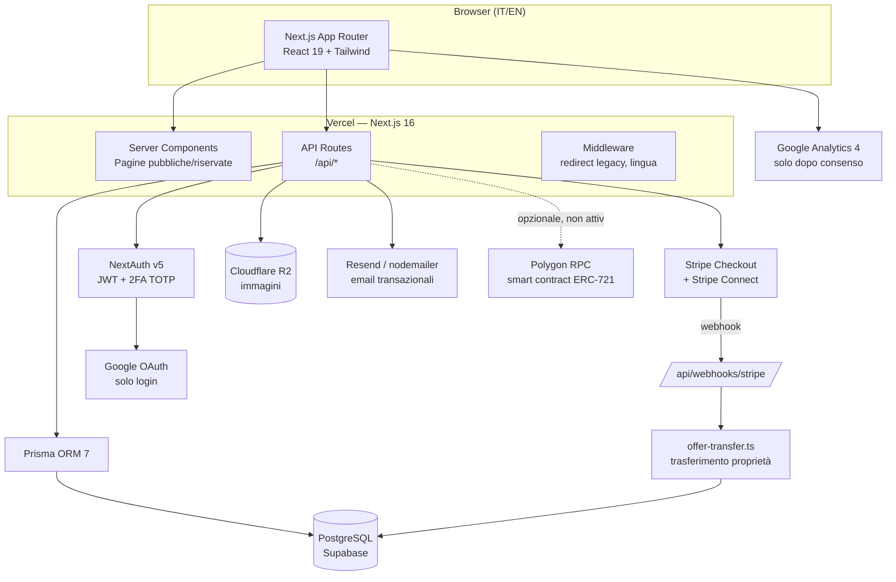
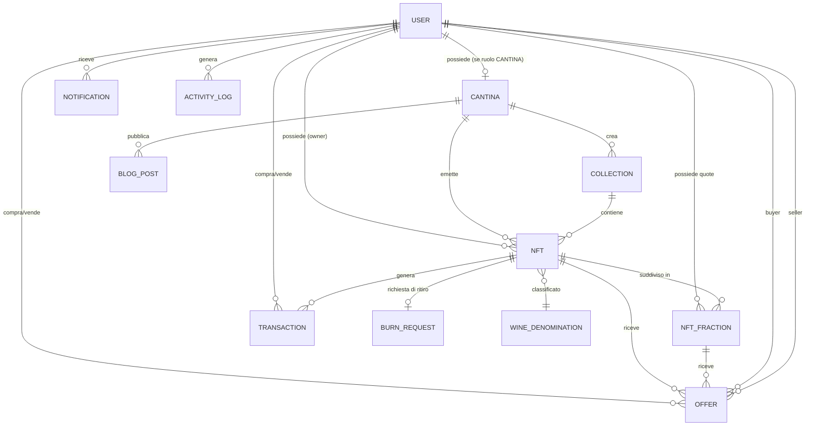

# Wine Bank 24 — Analisi Tecnica e Strategica

**Data dell'analisi:** 16 agosto 2026
**Repository analizzato:** `/Users/melissa/Desktop/winebank24` (locale, corrispondente a `dcmediasrl-lang/winebank24`)
**Branch:** `main` — **Commit analizzato:** `55f6ccc18e991c3f3c34c031374618cbdb21d0a2` ("Impianto SEO per il mercato internazionale del vino da collezione")

**Limiti dell'analisi**
- Analisi statica del codice sorgente, dello schema del database e della documentazione presente nel repository. Non è stata eseguita alcuna interazione con l'ambiente di produzione, né con servizi esterni (Stripe, Google, database reale).
- Non sono stati eseguiti test invasivi, penetration test, scritture sul database o comandi distruttivi. Sono stati usati esclusivamente comandi di lettura (`find`, `grep`, `cat`, lettura di file).
- Il file `.env` presente nel repository non è stato letto nei suoi valori: nel presente documento sono riportati solo i **nomi** delle variabili d'ambiente previste (da `.env.example`), mai i valori.
- Nessun segreto, password, token, chiave API o dato personale è riportato in questo documento.
- Il codice riflette lo stato del progetto a questa data; funzionalità dichiarate "in corso" nella documentazione interna (`STATO-PROGETTO.md`) possono evolvere rapidamente.
- L'analisi non costituisce parere legale, fiscale, contabile o di proprietà intellettuale: dove necessario, il documento segnala esplicitamente la necessità di un professionista abilitato.

---

## 1. Executive summary

Wine Bank 24 è una piattaforma web (applicazione Next.js) che digitalizza il rapporto tra cantine produttrici di vino e collezionisti privati attraverso **certificati digitali di proprietà** collegati a bottiglie fisiche reali, conservate presso la cantina. Il progetto è **verificabile nel codice**: esiste uno schema di database completo, un'interfaccia per tre tipi di utenti (amministratore, cantina, collezionista), un sistema di pagamento integrato (Stripe) e un impianto di regole di conformità esplicite (nessun linguaggio finanziario, verifica dell'età, validazione fiscale internazionale).

**Il problema che il progetto dichiara di affrontare** (fonte: `STATO-PROGETTO.md`, non verificabile con dati di mercato esterni) è la difficoltà per un collezionista di acquistare, provare la proprietà e infine ritirare fisicamente una bottiglia pregiata, oggi gestita perlopiù con documentazione cartacea o informale, e la difficoltà per una piccola cantina di raggiungere collezionisti al di fuori dei canali tradizionali (enoteche, aste, distributori).

**La soluzione implementata**: la cantina crea un "certificato" digitale (record `Nft` nel database, con dati della bottiglia — annata, formato, denominazione, posizione di custodia) e lo mette in vendita sul marketplace pubblico. Un collezionista lo acquista tramite Stripe Checkout; solo dopo la conferma del pagamento (webhook Stripe verificato) la proprietà del certificato passa all'acquirente. Il collezionista può poi rivendere il certificato ad altri collezionisti, fare offerte, oppure — solo se la cantina lo abilita esplicitamente — richiedere il ritiro fisico della bottiglia, pagando una fee di riscatto, IVA e spedizione. Il sistema supporta anche la **vendita frazionata**: più collezionisti possono comprare quote dello stesso certificato ad alto valore, e il ritiro fisico è possibile solo a chi arriva a possedere il 100% delle quote.

**Beneficiari individuati nel codice**: (1) le *cantine*, che emettono certificati, incassano tramite Stripe Connect e possono gestire un blog e un profilo pubblico; (2) i *collezionisti*, che acquistano, rivendono, mettono in wishlist e possono richiedere il ritiro; (3) l'*amministratore di piattaforma*, che approva le cantine, gestisce le richieste di ritiro, monitora le transazioni e configura le commissioni.

**Componenti tecnologiche principali** (verificate nel codice): Next.js 16 con React 19 e TypeScript; database PostgreSQL gestito tramite Prisma ORM (evidenza: `prisma/schema.prisma`, 20 modelli dati); autenticazione con NextAuth v5 (credenziali con bcrypt + login Google limitato a chi si è già registrato, più autenticazione a due fattori TOTP); pagamenti con Stripe Checkout e Stripe Connect per lo split automatico degli incassi verso le cantine; archiviazione immagini su Cloudflare R2; un contratto smart contract ERC-721 scritto in Solidity (`contracts/WineBank24.sol`) per una blockchain Polygon, **presente nel codice ma non attivato in produzione** (dichiarazione esplicita in `STATO-PROGETTO.md`: "Blockchain Polygon: Codice pronto, non attivata fino alla decisione sul lancio").

**Elemento potenzialmente distintivo**: la combinazione, in un'unica piattaforma, di (a) certificazione digitale di proprietà di un bene fisico deperibile/collezionabile, (b) mercato secondario tra privati con royalty automatica al produttore originario, (c) meccanismo di comproprietà frazionata con condizione di sblocco del riscatto fisico legata al possesso del 100% delle quote, e (d) un impianto di conformità esplicito che vieta il lessico finanziario in tutto il prodotto (testi, codice, email) per restare fuori dal perimetro degli strumenti finanziari. Si tratta di una **deduzione basata sulla combinazione di funzionalità osservate**, non di un giudizio di unicità di mercato: una verifica di originalità richiede una ricerca esterna che questa analisi non ha svolto.

**Stato di sviluppo osservabile**: il codice implementa flussi end-to-end funzionanti per registrazione, KYC, emissione, acquisto primario, rivendita secondaria, offerte, frazionamento e richiesta di ritiro fisico, con pagamenti reali via Stripe (in modalità test) e protezioni di sicurezza attive (rate limiting, blocco account, log delle attività, controlli anti-doppia-vendita). Non esiste una suite di test automatici nel repository (nessun file `*.test.*` o `*.spec.*` trovato). Il catalogo pubblico risulta oggi **vuoto per scelta**: le uniche due cantine presenti nel database sono marcate come contenuto dimostrativo (`isDemo: true`) e vengono nascoste in produzione. Diversi ticket di lavoro interni risultano ancora aperti, in particolare l'assenza dei dati societari ufficiali (partita IVA, ragione sociale) necessari prima di poter emettere certificati reali con pagamenti live.

---

## 2. Descrizione del progetto in una frase

**Definizione (max 30 parole):**
> Piattaforma web che collega cantine e collezionisti tramite certificati digitali di proprietà per bottiglie di vino reali, con acquisto, rivendita e riscatto fisico regolati da pagamento verificato.

**Definizione (max 100 parole):**
> Wine Bank 24 è un'applicazione web (Next.js/TypeScript) che permette a cantine produttrici di emettere certificati digitali collegati a bottiglie di vino fisiche custodite in loco, e a collezionisti privati di acquistarli tramite pagamento elettronico verificato (Stripe), rivenderli tra loro con royalty automatica alla cantina d'origine, acquistarne quote frazionate quando il valore è elevato, ed eventualmente richiederne il ritiro fisico se la cantina lo consente. La piattaforma applica commissioni sulle transazioni, effettua verifica anagrafica e fiscale internazionale dei collezionisti, e predispone — senza averla ancora attivata — l'ancoraggio dei certificati a una blockchain pubblica (Polygon).

**Descrizione estesa (circa 250 parole):**
> Wine Bank 24 nasce come infrastruttura software per digitalizzare il rapporto tra produttori vitivinicoli e collezionisti privati di vino pregiato. Il nucleo del prodotto è un registro di "certificati" (tecnicamente record `Nft` nel database, potenzialmente ancorabili a token ERC-721 su blockchain Polygon) ciascuno collegato a una bottiglia fisica specifica, con dati di annata, formato, denominazione, storia e luogo di custodia. Una cantina registrata sulla piattaforma — dopo aver caricato una polizza assicurativa e accettato un contratto digitale — può emettere un certificato per ogni bottiglia e metterlo in vendita sul marketplace pubblico. Un collezionista registrato, dopo una verifica anagrafica e fiscale (codice fiscale italiano, TIN europeo o ITIN statunitense, con validazione a checksum e incrocio con i dati anagrafici) e la verifica della maggiore età, può acquistare il certificato pagando tramite Stripe; solo alla conferma del pagamento la proprietà si trasferisce. Il collezionista può poi rivendere il certificato ad altri collezionisti (con una royalty automatica versata alla cantina d'origine), fare o ricevere offerte, aggiungerlo ai preferiti, oppure — solo quando la cantina abilita esplicitamente questa opzione per quel certificato — richiedere il ritiro fisico della bottiglia, pagando una fee di servizio, l'IVA e la spedizione. Per bottiglie di valore elevato è previsto un meccanismo di comproprietà frazionata, con vendita di quote a più collezionisti; il ritiro fisico in questo caso richiede l'acquisizione dell'intero 100% delle quote. La piattaforma applica commissioni distinte per acquirente, venditore e cantina, gestisce notifiche, un blog per cantina, e un pannello amministrativo per l'approvazione delle cantine e delle richieste di ritiro.

---

## 3. Problema, soluzione e valore generato

| Problema rilevato | Soluzione proposta | Funzionalità collegata | Beneficiario | Beneficio concreto | Evidenza nel repository |
|---|---|---|---|---|---|
| Difficoltà a dimostrare in modo verificabile la proprietà di una bottiglia da collezione nel tempo *(deduzione — non documentata con dati di mercato)* | Certificato digitale univoco per bottiglia, con cronologia di transazioni | Modello `Nft` + `Transaction`, storico proprietari | Collezionista | Prova di proprietà tracciabile e trasferibile | `prisma/schema.prisma` (modelli `Nft`, `Transaction`) |
| Rischio di doppia vendita o trasferimento di proprietà senza pagamento confermato *(fatto verificato: era un bug reale, corretto)* | Trasferimento di proprietà eseguito **solo** dal webhook Stripe dopo pagamento confermato, con verifica che il venditore possieda ancora il bene | `executeOfferTransfer`, `executeFractionResaleTransfer`, controllo idempotenza su `stripeId` | Collezionista (acquirente e venditore), piattaforma | Evita transazioni fantasma e doppie vendite | `src/lib/offer-transfer.ts`, `src/app/api/webhooks/stripe/route.ts` |
| Bottiglie di alto valore fuori dalla portata del singolo collezionista *(deduzione plausibile dal design del frazionamento)* | Comproprietà frazionata: più collezionisti acquistano quote dello stesso certificato | Modello `NftFraction`, checkout frazionato | Collezionista con budget limitato, cantina (vende bottiglie di pregio a più acquirenti) | Accesso a beni collezionistici di valore elevato con capitale ridotto | `prisma/schema.prisma` (modello `NftFraction`), `src/app/api/checkout/fraction/route.ts` |
| Rischio regolatorio: una piattaforma che vende quote di un bene con linguaggio finanziario rischia di ricadere sotto la normativa MiFID II *(informazione dichiarata — richiede parere legale)* | Divieto esplicito e sistematico di lessico finanziario (investimento, rendimento, portafoglio, ecc.) in codice e testi | Regola di progetto vincolante, verificata nei testi pubblici | Piattaforma, cantine, collezionisti | Riduzione del rischio di qualificazione come prodotto finanziario | `STATO-PROGETTO.md` ("Posizionamento — vincolo non negoziabile") |
| Cantine piccole con difficoltà di accesso a un pubblico di collezionisti oltre i canali tradizionali *(deduzione plausibile, non documentata)* | Marketplace pubblico, profilo cantina, blog dedicato | Pagine `/cantine`, `/blog`, dashboard cantina | Cantina (soprattutto piccola/media) | Canale di vendita diretta digitale | `src/app/[lang]/cantine`, `src/app/[lang]/cantina/blog` |
| Frode e furto di identità nella registrazione internazionale di collezionisti | Validazione del codice fiscale/TIN/ITIN con checksum specifico per 28 paesi, incrocio con nome/cognome/data di nascita, unicità nel database | `src/lib/tax-id.ts`, vincolo `@unique` su `User.fiscalCode` | Piattaforma, cantina (riduce rischio di controparte) | Riduzione delle registrazioni duplicate o con dati falsi | `src/lib/tax-id.ts`, `prisma/schema.prisma` |
| Consegna della bottiglia non regolata, rischio di ritiro simultaneo da parte di più contitolari o di beni non ancora pagati per intero | Riscatto fisico attivabile solo dalla cantina, e solo se il collezionista possiede il 100% delle quote | `src/app/api/collector/burn-checkout/route.ts` | Cantina, collezionista | Evita spedizioni indebite o contese sulla proprietà | `src/app/api/collector/burn-checkout/route.ts` |
| Nessuna prova che l'assicurazione dichiarata sulla bottiglia esista davvero | Blocco tecnico: la cantina non può emettere nuovi certificati senza aver caricato una polizza assicurativa | Controllo in `mint/route.ts` | Collezionista, cantina | Coerenza tra quanto dichiarato pubblicamente e quanto verificato dalla piattaforma | `src/app/api/cantina/mint/route.ts` (righe 49–57) |

---

## 4. Utenti e stakeholder

Il codice definisce **tre ruoli utente** nel database (`enum Role { ADMIN, CANTINA, COLLECTOR }`, `prisma/schema.prisma`). Altri soggetti (assicurazioni, operatori logistici, partner finanziari) sono menzionati solo come controparti esterne, non come utenti con accesso alla piattaforma.

### 4.1 Amministratore (ADMIN) — *fatto verificato*
- **Ruolo:** gestore della piattaforma.
- **Esigenze:** supervisione, approvazione, conformità.
- **Operazioni consentite** (evidenza: `src/app/[lang]/admin/*`, `src/app/api/admin/*`): approvazione e gestione delle cantine (`admin/cantine`), gestione utenti (`admin/users`), gestione del database vini/denominazioni (`admin/wine-db`), gestione blog generale (`admin/blog`), monitoraggio transazioni (`admin/transactions`), gestione payout (`admin/payouts`), approvazione delle richieste di ritiro fisico (`api/admin/burn-approve`), configurazione delle commissioni di piattaforma (`api/admin/config`, modello `PlatformConfig`).
- **Dati gestiti:** dati di tutti gli utenti, transazioni, configurazioni di sistema.
- **Valore ricevuto:** controllo centralizzato e strumenti di conformità.
- **Limitazioni:** un amministratore non può cancellare il proprio account dal pannello finché non trasferisce il ruolo (evidenza: `src/lib/account-deletion.ts`).

### 4.2 Cantina (CANTINA) — *fatto verificato*
- **Ruolo:** produttore/detentore delle bottiglie fisiche, emittente dei certificati.
- **Esigenze:** vendere bottiglie a un pubblico di collezionisti, incassare in modo automatizzato, dimostrare affidabilità (assicurazione, contratto).
- **Operazioni consentite:** emissione di certificati (`cantina/nfts`, `api/cantina/mint`) — **bloccata se manca la polizza assicurativa caricata**; gestione delle collezioni; accettazione di un contratto digitale (`api/cantina/accept-contract`); collegamento di un account Stripe Connect per l'incasso diretto (`api/cantina/stripe-connect`); gestione di un blog dedicato (`cantina/blog`); gestione delle offerte ricevute; impostazione della royalty per certificato (1–10%, `royaltyPct` nel modello `Nft`).
- **Dati gestiti:** anagrafica azienda (nome, sede, P.IVA, IBAN/BIC come alternativa a Stripe), documento di polizza assicurativa, contratto accettato.
- **Valore ricevuto:** canale di vendita diretta, incasso automatizzato via Stripe Connect, royalty automatica sulle rivendite secondarie.
- **Limitazioni/dipendenze esterne:** dipende da Stripe Connect per l'incasso automatico; senza collegamento Stripe, resta l'alternativa IBAN/BIC (bonifico manuale — non automatizzato, non tracciato dal webhook). Non può emettere certificati senza assicurazione caricata.

### 4.3 Collezionista (COLLECTOR) — *fatto verificato*
- **Ruolo:** acquirente/detentore di certificati.
- **Esigenze:** accesso a bottiglie da collezione, sicurezza sulla proprietà, possibilità di rivendita o ritiro fisico.
- **Operazioni consentite:** acquisto tramite Stripe Checkout (`api/checkout`); consultazione marketplace con propria collezione (`collector/collezione` — ex "portfolio", rinominato, redirect legacy attivo in `src/middleware.ts`); rivendita a terzi; invio/ricezione di offerte (`api/offers`); acquisto di quote frazionate (`api/checkout/fraction`); wishlist e preferiti; richiesta di ritiro fisico della bottiglia (`api/collector/burn-checkout`); gestione notifiche e relative preferenze; cancellazione dell'account (diritto GDPR, `api/user/delete-account`).
- **Dati gestiti:** anagrafica KYC (nome, cognome, data di nascita, paese, codice fiscale/TIN/ITIN), documento d'identità caricato, storico attività (`ActivityLog`).
- **Valore ricevuto:** accesso a bottiglie da collezione con provenienza documentata, possibilità di mercato secondario, eventuale possesso fisico finale.
- **Limitazioni:** la maggiore età (18+) è richiesta; i dati anagrafici, una volta verificati, **non sono più modificabili in autonomia** dall'utente (blocco in `api/user/kyc/route.ts`) — richiedono contatto diretto con il supporto.

### 4.4 Stakeholder non-utente, presenti solo come riferimento nel codice o nella documentazione
Queste categorie **non hanno un accesso diretto alla piattaforma**: sono controparti esterne del processo, citate nel codice o nei documenti interni. Vanno considerate ipotesi operative da validare con i fondatori, non funzionalità software.

| Stakeholder | Evidenza | Natura del riferimento |
|---|---|---|
| Compagnia assicurativa | `Cantina.insuranceDocUrl`, pagina `cantina/assicurazione` | La cantina carica un documento; nessuna integrazione diretta con un assicuratore |
| Corriere/operatore logistico | `Nft.shippingCost`, flusso di ritiro (`burn-checkout`) | Costo di spedizione è un campo numerico impostato manualmente; non risulta integrazione con corrieri (tracking, etichette) — coerente con il ticket aperto **WB-14** in `STATO-PROGETTO.md` |
| Istituto di pagamento (Stripe) | Stripe Checkout + Connect | Fornitore di infrastruttura di pagamento, non stakeholder del prodotto in senso proprio |
| Consulente legale | Citato in `STATO-PROGETTO.md` per la formula MiFID II e la vendita frazionata | Nessun accesso alla piattaforma; riferimento a un parere ancora da ottenere |

---

## 5. Funzionalità della piattaforma

### 5.1 Funzionalità implementate
*(presenti nel codice e collegate a un flusso utilizzabile end-to-end)*

| Funzionalità | Descrizione | Utente | Stato | Frontend | Backend | Database | Servizi esterni | Evidenza |
|---|---|---|---|---|---|---|---|---|
| Registrazione con email/password | Creazione account con validazione | Collector/Cantina | Implementata | form registrazione | `api/auth/register` | `User` | — | `src/app/api/auth/register/route.ts` |
| Login credenziali + blocco account | 5 tentativi falliti → blocco 30 min | Tutti | Implementata | login page | `src/lib/auth.ts` | `User.failedLoginAttempts`, `lockedUntil` | — | `src/lib/auth.ts` righe 61–114 |
| Autenticazione a due fattori (TOTP) | Codice a 6 cifre richiesto al login se attivo | Tutti | Implementata | login page | `otplib` in `auth.ts` | `User.twoFactorSecret/Enabled` | — | `src/lib/auth.ts` righe 87–108 |
| Login con Google (solo accesso, non registrazione) | Consente l'accesso via Google solo a chi ha già un account con password impostata | Tutti | Implementata | pulsante Google | callback `signIn` in `auth.ts` | `Account` | Google OAuth | `src/lib/auth.ts` righe 122–136 |
| Verifica email | Token con scadenza 24h | Tutti | Implementata | — | `api/auth/verify-email` | `User.emailVerifyToken/Expiry` | invio email (Resend/nodemailer) | `src/lib/email.ts`, schema |
| Reset password | Token con scadenza | Tutti | Implementata | — | `api/auth/forgot-password`, `reset-password` | `User.passwordResetToken/Expiry` | invio email | route dedicate |
| Validazione fiscale internazionale | Checksum per 28 paesi (IT, US-ITIN, 26 UE), incrocio anagrafico | Collector | Implementata | form KYC | `src/lib/tax-id.ts` | `User.fiscalCode` (unique) | — | `src/lib/tax-id.ts` |
| KYC write-once | Dati anagrafici bloccati dopo la prima verifica | Collector | Implementata | pagina "anagrafica" (sola lettura) | `api/user/kyc/route.ts` | `User` | — | `src/app/api/user/kyc/route.ts` |
| Emissione certificato (mint) | Cantina crea un certificato per una bottiglia, paga una fee di emissione | Cantina | Implementata | `cantina/nfts` | `api/cantina/mint` | `Nft`, `Collection` | Stripe Checkout (fee), opzionale blockchain | `src/app/api/cantina/mint/route.ts` |
| Blocco emissione senza assicurazione | Impedisce il mint se manca `insuranceDocUrl` | Cantina | Implementata | — | `mint/route.ts` righe 49–57 | `Cantina.insuranceDocUrl` | — | idem |
| Marketplace pubblico | Elenco certificati in vendita | Collector/pubblico | Implementata | `marketplace/page.tsx` | query Prisma | `Nft` (isListed) | — | `src/app/[lang]/marketplace` |
| Acquisto primario/secondario | Checkout con calcolo commissioni distinte | Collector | Implementata | pagina NFT | `api/checkout/route.ts` | `Nft`, `Transaction` | Stripe Checkout + Connect | `src/app/api/checkout/route.ts` |
| Trasferimento proprietà solo post-pagamento | Nessun trasferimento senza conferma webhook | Sistema | Implementata | — | `api/webhooks/stripe`, `offer-transfer.ts` | `Nft`, `Transaction`, `Offer` | Stripe Webhook | `src/lib/offer-transfer.ts` |
| Idempotenza webhook / anti doppia-vendita | Verifica `stripeId` già processato, verifica possesso venditore | Sistema | Implementata | — | `api/webhooks/stripe/route.ts` | `Transaction.stripeId` | Stripe | file citato |
| Offerte tra collezionisti | Invio, accettazione, rifiuto, ritiro | Collector | Implementata | `collector/offerte`, `cantina/offerte` | `api/offers`, `api/offers/[id]` | `Offer` | — | route dedicate |
| Vendita frazionata | Acquisto di quote di un certificato ad alto valore | Collector | Implementata | pagina NFT | `api/checkout/fraction` | `NftFraction` | Stripe | `src/lib/offer-transfer.ts` righe 100–182 |
| Rivendita di quote (intera o parziale) | Un titolare di quota può rimetterla in vendita | Collector | Implementata | — | `executeFractionResaleTransfer` | `NftFraction` | Stripe | `src/lib/offer-transfer.ts` righe 194–288 |
| Riscatto/ritiro fisico | Solo se abilitato dalla cantina; su frazionati richiede il 100% delle quote | Collector | Implementata | pagina NFT/collezione | `api/collector/burn-checkout` | `Nft.physicalDeliveryUnlocked`, `BurnRequest` | Stripe (fee+IVA+spedizione) | `src/app/api/collector/burn-checkout/route.ts` |
| Approvazione amministrativa del ritiro | L'admin approva la richiesta di burn | Admin | Implementata | `admin/nfts` | `api/admin/burn-approve` | `BurnRequest.approved` | — | route dedicata |
| Wishlist e preferiti | Desiderata pubbliche/private, preferiti su certificati | Collector | Implementata | `collector/wishlist`, `preferiti` | `api/collector/wishlist` | `WishlistItem`, `FavoriteNft` | — | schema, route |
| Notifiche in-app (collector e cantina) | Eventi su offerte, vendite, acquisti | Tutti tranne pubblico | Implementata | `*/notifiche` | — | `Notification`, `NotificationPreference` | — | schema, `src/lib/notifications.ts` |
| Blog per cantina e generale | Contenuti pubblicati in IT/EN | Cantina, Admin, pubblico | Implementata | `blog`, `cantina/blog` | `api/cantina/blog`, `api/admin/blog` | `BlogPost` | — | schema |
| Diritto alla cancellazione (GDPR art. 17) | Anonimizzazione con blocchi espliciti (ruolo, beni posseduti, offerte aperte) | Collector/Cantina | Implementata | `api/user/delete-account` | `src/lib/account-deletion.ts` | `User` (anonimizzato) | — | file citato |
| Rate limiting su azioni sensibili | Login, checkout limitati per IP/utente | Sistema | Implementata | — | `src/lib/rate-limit.ts` | `RateLimit` | — | file citato |
| Log delle attività | Traccia login, acquisti, blocchi account | Sistema/Admin | Implementata | `admin`, `collector/reports` | `src/lib/activity.ts` | `ActivityLog` | — | schema |
| Header di sicurezza HTTP | X-Frame-Options, HSTS, CSP immagini, ecc. | Sistema | Implementata | — | `next.config.ts` | — | — | `next.config.ts` |
| Filtro contenuti demo | Cantine/certificati dimostrativi nascosti in produzione | Sistema | Implementata | tutte le pagine pubbliche | `src/lib/demo-content.ts` | `Cantina.isDemo` | — | file citato |
| SEO internazionale (hreflang, canonical, OG, JSON-LD) | Metadati multilingua IT/EN | Pubblico | Implementata | tutte le pagine pubbliche | `src/lib/seo.ts`, `dati-strutturati.tsx` | — | — | file citati |
| Internazionalizzazione IT/EN | Contenuti in due lingue tramite `[lang]` | Tutti | Implementata | routing `[lang]` | `dictionaries/` | — | — | `src/app/[lang]`, `dictionaries/` |
| Database denominazioni vinicole | 101 denominazioni precaricate (DOC/DOCG/IGT) | Cantina (in fase di mint) | Implementata | ricerca in form mint | `api/wine-denominations/search` | `WineDenomination` | — | `prisma/seed-wine.ts` (101 voci) |

### 5.2 Funzionalità parzialmente implementate
*(presenti ma incomplete, non integrate end-to-end, o disattivate per scelta)*

| Funzionalità | Descrizione | Stato | Evidenza |
|---|---|---|---|
| Ancoraggio blockchain (Polygon) | Smart contract ERC-721 completo (`mint`, `burnBottle`, tracciamento bottiglia) e libreria di collegamento (`src/lib/blockchain.ts`) esistono; il mint controlla `blockchainReady` e, se le variabili d'ambiente del wallet/contratto non sono impostate, **procede solo su database**, senza bloccare l'operazione | Codice pronto, **non attivato in produzione** (dichiarazione esplicita in `STATO-PROGETTO.md`) | `contracts/WineBank24.sol`, `src/lib/blockchain.ts`, `src/app/api/cantina/mint/route.ts` righe 28–32, 111–129 |
| Pagamento cantina via bonifico (IBAN/BIC) | Campi `iban`, `bic`, `bankName` presenti nel modello `Cantina` come alternativa a Stripe Connect | Il modello dati esiste; non risulta un flusso automatizzato di conferma/tracciamento del bonifico nel codice ispezionato | `prisma/schema.prisma` (modello `Cantina`) |
| Spedizione fisica / logistica | Il campo `shippingCost` è un numero impostato manualmente sul certificato; non risultano integrazioni con corrieri, tracking o conferma di consegna | Flusso di ritiro si ferma all'approvazione admin — coerente con ticket **WB-14** aperto in `STATO-PROGETTO.md` | `prisma/schema.prisma` (`Nft.shippingCost`), `STATO-PROGETTO.md` |
| Report/analytics per cantina e collezionista | Pagine `cantina/reports`, `collector/reports` esistono nella struttura di routing | Non è stato letto il contenuto dettagliato di queste pagine in questa sessione; da verificare se mostrano dati reali o placeholder | `src/app/[lang]/cantina/reports`, `src/app/[lang]/collector/reports` (contenuto non ispezionato in dettaglio) |

### 5.3 Funzionalità pianificate o dichiarate
*(presenti solo nella documentazione interna o nei ticket, non nel codice funzionante)*

| Funzionalità | Fonte | Stato dichiarato |
|---|---|---|
| Ruoli "custode", "operatore" e "collezionista verificato" | `STATO-PROGETTO.md`, ticket **WB-13** | Non presenti nell'enum `Role` del database; oggi la cantina svolge anche il ruolo di custode |
| Filtri di catalogo avanzati (produttore, formato, fascia di prezzo, custode, stato di verifica) e ordinamento | `STATO-PROGETTO.md`, ticket **WB-12** | Dichiarato incompleto |
| Scheda bottiglia con fotografie multiple, condizioni, provenienza dettagliata | `STATO-PROGETTO.md`, ticket **WB-10** | Il modello `Nft` ha già `imageGallery` (1–4 immagini) e `bottleStory`/`currentLocation`, ma il ticket indica che la presentazione pubblica è ancora incompleta rispetto al mandato di progetto |
| Controllo automatico anti-ritorno del lessico finanziario | `STATO-PROGETTO.md`, ticket **WB-15** | Dichiarato assente; oggi il controllo è manuale/editoriale |
| Misurazione accessibilità/performance (WCAG 2.2 AA) | `STATO-PROGETTO.md`, ticket **WB-16** | Dichiarato: "mai misurate" |
| Dati societari ufficiali (ragione sociale, P.IVA, REA, PEC) centralizzati | `STATO-PROGETTO.md`, ticket **WB-06**, bloccante | Footer mostra ancora "P.IVA: in fase di registrazione"; nome su Stripe checkout non ancora corretto |

### 5.4 Funzionalità ipotizzabili ma non dimostrate
*(possibili sviluppi coerenti col progetto, non presenti in alcuna forma nel codice o nella documentazione — indicate solo come spunto, da validare con i fondatori)*

- Marketplace secondario con aste a tempo (oggi esiste solo compravendita a prezzo fisso e offerte dirette).
- Integrazione diretta con corrieri per etichette di spedizione e tracking automatico.
- App mobile nativa (non risultano progetti iOS/Android nel repository).
- Modulo di raccomandazione algoritmica di bottiglie ai collezionisti (nessuna evidenza di logica di raccomandazione o ML nel codice).
- Certificazione o autenticazione multi-parte della bottiglia (es. da parte di un ente terzo indipendente dalla cantina emittente).

---

## 6. Flussi operativi

Per ciascun flusso: passaggi ricostruiti dal codice, con segnalazione esplicita di ciò che manca o è mock.

### 6.1 Registrazione e accesso — *implementato*
1. Utente compila form di registrazione → `POST /api/auth/register` crea `User` con password hashata (bcrypt).
2. Email di verifica inviata con token (scadenza 24h).
3. Login con credenziali: verifica bcrypt, controllo blocco account (5 tentativi falliti → 30 minuti di blocco), eventuale richiesta di codice 2FA (TOTP).
4. **Accesso con Google**: non crea un nuovo account. Il callback `signIn` verifica che esista già un `User` con `password` impostata per quell'email; altrimenti reindirizza a login con errore `google_not_registered`. *(Fatto verificato: `src/lib/auth.ts` righe 122–136.)*
5. Nessun passaggio mancante rilevato in questo flusso.

### 6.2 Onboarding / completamento profilo — *implementato*
1. Dopo la registrazione (o il primo accesso Google), l'utente collezionista è reindirizzato a `complete-profile`.
2. Inserisce nome, cognome, data di nascita, paese, codice fiscale/TIN/ITIN.
3. `src/lib/tax-id.ts` valida formato, checksum dove previsto, e incrocio con nome/cognome/data di nascita (pieno per l'Italia, parziale per gli altri paesi in base al tipo di codice).
4. Verifica maggiore età (18+) lato server.
5. Una volta salvati, i dati diventano **non modificabili in autonomia** (`api/user/kyc/route.ts` righe con controllo `if (attuale?.fiscalCode || attuale?.birthDate) return 403`).

### 6.3 Creazione e gestione del profilo cantina — *implementato, con blocco condizionato*
1. La cantina compila il proprio profilo (`cantina/profilo`).
2. Carica la polizza assicurativa (`cantina/assicurazione`) → popola `Cantina.insuranceDocUrl`.
3. Accetta il contratto digitale (`cantina/contratto` → `api/cantina/accept-contract`).
4. Collega un account Stripe Connect (`api/cantina/stripe-connect`) per l'incasso automatico, oppure inserisce IBAN/BIC come alternativa (non automatizzata).
5. **Passaggio mancante segnalato**: senza `insuranceDocUrl` caricato, la cantina non può emettere alcun certificato — blocco tecnico verificato nel codice (§5.1).

### 6.4 Emissione di un certificato (mint) — *implementato*
1. Cantina compila il form con dati bottiglia (nome, annata, formato, denominazione, immagini 1–4, prezzo o valore totale se frazionabile).
2. Sistema crea una `Collection` "singleton" e un record `Nft` con stato `PENDING_PAYMENT`.
3. Se le variabili d'ambiente blockchain sono configurate, tenta il mint on-chain (Polygon); in caso di fallimento o assenza configurazione, **procede comunque solo su database** (fail-safe, non bloccante).
4. Viene calcolata una fee di emissione (percentuale sul valore bottiglia, minimo 0,50€) e creata una sessione Stripe Checkout a carico della cantina.
5. Il certificato diventa attivo solo dopo la conferma webhook del pagamento della fee (non ispezionato in dettaglio in questa sessione, ma coerente con `mintFeePaid`/`mintFeeStripeId` nello schema).

### 6.5 Ricerca e consultazione (marketplace) — *implementato, con limite dichiarato*
1. Elenco pubblico dei certificati con `isListed: true`, filtrato per escludere contenuto demo in produzione.
2. **Limite dichiarato**: filtri avanzati (formato, fascia di prezzo, custode, stato di verifica) e ordinamento risultano incompleti secondo il ticket **WB-12** — non verificato in dettaglio il codice del componente marketplace in questa sessione, ma la fonte interna del progetto lo dichiara esplicitamente.

### 6.6 Acquisto primario e secondario — *implementato*
1. Collezionista seleziona un certificato in vendita, avvia checkout (`api/checkout`).
2. Sistema calcola: prezzo base + commissione piattaforma (7% lato acquirente) + royalty cantina (solo su vendita secondaria) + eventuale fee venditore (3%, trattenuta dal ricavo del venditore).
3. Stripe Checkout mostra il dettaglio delle voci di costo all'acquirente.
4. Se la cantina ha Stripe Connect collegato, la piattaforma trattiene la propria commissione come `application_fee_amount` e il resto va automaticamente all'account Stripe della cantina (`transfer_data.destination`).
5. **Il trasferimento di proprietà avviene solo nel webhook**, dopo `checkout.session.completed`, con verifica anti-doppia-vendita.

### 6.7 Pagamento — *implementato*
Gestito interamente da Stripe Checkout (redirect esterno) + Stripe Connect per lo split. Le chiavi in uso sono di **test**, non live (dichiarazione esplicita in `STATO-PROGETTO.md`: "Non passare alle chiavi live finché i dati societari non sono completi").

### 6.8 Offerte tra collezionisti — *implementato*
1. Un collezionista fa un'offerta su un certificato o su una quota frazionata di un altro collezionista.
2. Il venditore accetta → stato `ACCEPTED`, in attesa di pagamento.
3. L'acquirente paga tramite Stripe.
4. Solo alla conferma webhook, `executeOfferTransfer` esegue il trasferimento e marca l'offerta `COMPLETED`; le altre offerte pendenti sullo stesso bene vengono automaticamente rifiutate.

### 6.9 Vendita frazionata — *implementato*
1. La cantina marca un certificato come frazionabile con un valore totale.
2. Più collezionisti acquistano quote (`percentage`, `investedAmount` nel modello `NftFraction`) fino a esaurimento del valore disponibile.
3. Un titolare di quota può rimetterla in vendita, per intero o in parte (`listedPercentage`).
4. Un collezionista può fare un'offerta di "liquidazione" per acquisire le quote di un altro titolare.

### 6.10 Verifica/certificazione — *parzialmente implementato*
- La "certificazione" della bottiglia coincide oggi con i dati inseriti dalla cantina stessa al momento del mint (autocertificazione), più il vincolo di aver caricato una polizza assicurativa.
- Non risulta nel codice ispezionato un meccanismo di verifica indipendente da parte di un soggetto terzo (es. perito, ente certificatore) — coerente con il ruolo "custode/operatore verificato" dichiarato come mancante (ticket WB-13).

### 6.11 Amministrazione — *implementato*
Pannello con approvazione cantine, gestione utenti, gestione denominazioni vinicole, monitoraggio transazioni e payout, approvazione delle richieste di ritiro fisico, configurazione delle percentuali di commissione (`PlatformConfig`).

### 6.12 Gestione di richieste, documenti e notifiche — *implementato*
- Notifiche in-app con preferenze per canale (in-app/email) e per tipo di evento (offerte, vendite, acquisti), sia lato collezionista sia lato cantina.
- Documenti: polizza assicurativa (upload), contratto digitale (PDF generato, evidenza `src/lib/contract-pdf.ts`).

### 6.13 Gestione logistica — *parzialmente implementata / mancante*
Il flusso si ferma alla richiesta di ritiro (`BurnRequest`) e alla sua approvazione amministrativa. **Non risultano nel codice**: generazione di un preventivo di spedizione, integrazione con corrieri, tracking, conferma di consegna. Coerente con il ticket aperto **WB-14**.

### 6.14 Assistenza — *minimale*
Non risulta un sistema di ticketing o chat di assistenza nel codice ispezionato; i contatti sono centralizzati in `src/lib/contatti.ts` (indirizzi email di supporto, privacy, no-reply) e diversi flussi (es. sblocco KYC, cancellazione account cantina) rimandano esplicitamente al contatto via email con il team.

---

## 7. Architettura tecnica

### 7.1 Descrizione generale
Applicazione monolitica **Next.js 16 (App Router)**, con frontend e backend nello stesso progetto: le pagine React (Server Components) convivono con le API route (`src/app/api/*`) nello stesso deployment. Il database è PostgreSQL ospitato su Supabase, raggiunto tramite Prisma ORM con l'adapter `@prisma/adapter-pg` (pool di connessioni). Il deployment è su Vercel.

### 7.2 Frontend
- React 19, TypeScript, Tailwind CSS 4, componenti UI basati su `@base-ui/react` e libreria icone `lucide-react`.
- Routing internazionalizzato tramite segmento dinamico `[lang]` (`it`/`en`), con dizionari in `dictionaries/`.
- Gestione stato lato client con Zustand e `@tanstack/react-query`; form con `react-hook-form` + `zod` per la validazione.

### 7.3 Backend / API
- API Route di Next.js (`src/app/api/**/route.ts`), organizzate per dominio: `auth`, `cantina`, `collector`, `checkout`, `offers`, `admin`, `webhooks`, `upload`, `user`, `wine-denominations`.
- Autorizzazione verificata a livello di singola route tramite `auth()` di NextAuth e controllo del ruolo (`session.user.role`).
- Validazione input con `zod` sugli endpoint ispezionati (es. `checkout/route.ts`, `cantina/mint/route.ts`).

### 7.4 Database
PostgreSQL, schema gestito con Prisma (versione 7). 20 modelli dati (dettaglio §9). Vincoli di unicità rilevanti: `User.email`, `User.fiscalCode`, `User.username`, `User.passwordResetToken`, `Account (provider, providerAccountId)`, `FavoriteNft (userId, nftId)`.

### 7.5 Autenticazione e autorizzazione
NextAuth v5 (beta), strategia JWT (sessione 7 giorni, non il default di 30 — scelta motivata nel codice come riduzione della finestra di rischio su una piattaforma con pagamenti). Provider: credenziali (bcrypt + 2FA opzionale TOTP) e Google OAuth (solo login, mai registrazione). Middleware (`src/middleware.ts`) gestisce redirect legacy e propaga il pathname per la selezione lingua.

### 7.6 Gestione dei file
Upload immagini tramite endpoint `api/upload`, archiviazione su **Cloudflare R2** (S3-compatibile) tramite `@aws-sdk/client-s3` (`src/lib/storage.ts`). Le immagini NFT sono limitate a domini R2 e Unsplash nella configurazione Next.js Image (`remotePatterns`).

### 7.7 Servizi cloud e SaaS esterni
| Servizio | Funzione | Evidenza |
|---|---|---|
| Vercel | Hosting e deploy | `STATO-PROGETTO.md`, `.vercel/` |
| Supabase (PostgreSQL) | Database | `STATO-PROGETTO.md`, `DATABASE_URL` in `.env.example` |
| Stripe (Checkout + Connect) | Pagamenti, split automatico | `src/lib/stripe.ts`, route `checkout`, `webhooks/stripe` |
| Cloudflare R2 | Storage oggetti (immagini) | `src/lib/storage.ts` |
| Google OAuth | Login (non registrazione) | `src/lib/auth.ts` |
| Resend / nodemailer | Invio email transazionali | `src/lib/email.ts`, dipendenze `resend`, `nodemailer` |
| Google Analytics 4 | Analytics, **solo dopo consenso cookie** | `src/components/shared/analytics.tsx` |
| Polygon (RPC) | Blockchain, **non attiva** | `POLYGON_RPC_URL` in `.env.example`, `src/lib/blockchain.ts` |

### 7.8 Codice, job o processi asincroni
Non risultano code o job scheduler dedicati (es. non è presente un sistema tipo BullMQ/cron job nel codice ispezionato). L'unico meccanismo asincrono osservato è il webhook Stripe, gestito come endpoint HTTP invocato da Stripe stesso.

### 7.9 Notifiche
Sistema di notifiche in-app persistite su database (modello `Notification`), con preferenze utente per canale ed evento (`NotificationPreference`). L'invio email è gestito da `src/lib/email.ts` (verifica, benvenuto, contratto PDF, reset password).

### 7.10 Logging e monitoraggio
- `ActivityLog`: traccia azioni utente rilevanti (login falliti, blocchi, acquisti) con IP e user agent.
- Non risultano nel codice ispezionato strumenti di monitoraggio infrastrutturale (es. Sentry, Datadog) né dashboard di osservabilità applicativa oltre ai log di Vercel stesso (non verificabile da repository).

### 7.11 Ambienti
- Sviluppo locale (`npm run dev`), produzione su Vercel (`app.winebank24.eu`). Non risulta un ambiente di staging separato esplicito nel codice, sebbene `demo-content.ts` usi `VERCEL_ENV === "production"` come discriminante, il che implica un comportamento diverso in preview/staging di Vercel.
- Nessuna suite di test automatici trovata (`find` per `*.test.*`/`*.spec.*` non ha restituito risultati) — **assenza rilevata, non solo dichiarata**.

### 7.12 Deployment
Deploy manuale via CLI Vercel (`npx vercel deploy --prod`, da `STATO-PROGETTO.md`); non risulta una pipeline CI/CD automatizzata (nessun file in `.github/workflows` rilevato nella ricognizione).

### 7.13 Applicazioni mobile
Nessuna evidenza di progetto mobile nativo (iOS/Android) nel repository.

### 7.14 Intelligenza artificiale / machine learning
**Nessuna evidenza** di funzionalità di intelligenza artificiale, machine learning o sistemi di raccomandazione nel codice ispezionato. Da segnalare con chiarezza: se un bando richiede componenti AI/ML, questo aspetto **non è supportato dalle evidenze attuali** e non va dichiarato senza sviluppo dedicato.

### 7.15 Diagramma architetturale (Mermaid)

---

## 8. Stack tecnologico

| Area | Tecnologia | Versione rilevata | Utilizzo nel progetto | Criticità o dipendenza | Evidenza |
|---|---|---|---|---|---|
| Framework web | Next.js | 16.2.6 | Frontend + backend (App Router) | Framework recente, avvertenza nel repo stesso su breaking changes rispetto a versioni precedenti | `package.json`, `AGENTS.md` |
| Linguaggio | TypeScript | ^5 | Tutto il codice applicativo | — | `package.json` |
| UI | React | 19.2.4 | Interfaccia | — | `package.json` |
| Stile | Tailwind CSS | ^4 | Styling | — | `package.json` |
| ORM | Prisma | ^7.8.0 | Accesso al database | Migrazione a v7 recente, adapter `@prisma/adapter-pg` | `package.json`, `prisma/schema.prisma` |
| Database | PostgreSQL (Supabase) | n/d (gestito) | Persistenza dati | Dipendenza da provider esterno (Supabase) | `STATO-PROGETTO.md` |
| Autenticazione | NextAuth | ^5.0.0-beta.31 | Login, sessioni, OAuth | **Versione beta**: rischio di instabilità/breaking change prima della release stabile | `package.json` |
| Hashing password | bcryptjs | ^3.0.3 | Sicurezza credenziali | — | `package.json` |
| 2FA | otplib | ^13.4.0 | TOTP | — | `package.json`, `src/lib/auth.ts` |
| Pagamenti | Stripe (SDK server + client) | stripe ^22.1.1 / @stripe/stripe-js ^9.5.0 | Checkout, Connect, webhook | Dipendenza critica; chiavi attualmente di test | `package.json`, `src/lib/stripe.ts` |
| Storage oggetti | @aws-sdk/client-s3 (verso Cloudflare R2) | ^3.1048.0 | Upload immagini | Dipendenza da Cloudflare R2 | `src/lib/storage.ts` |
| Email | Resend, nodemailer | resend ^6.12.3 / nodemailer ^7.0.13 | Invio email transazionali | Doppia libreria presente: da verificare quale sia effettivamente in uso in produzione | `package.json`, `src/lib/email.ts` |
| Blockchain (non attiva) | ethers.js | ^6.16.0 | Interazione con smart contract | Non collegata in produzione | `package.json`, `src/lib/blockchain.ts` |
| Smart contract | Solidity + OpenZeppelin (ERC721URIStorage, Ownable) | Solidity ^0.8.20, OZ ^5.6.1 | Certificato on-chain (ERC-721) | Non deployato/attivato secondo la documentazione interna | `contracts/WineBank24.sol` |
| Ambiente contratti | Hardhat | ^3.4.5 | Compilazione/test smart contract | Nessun test Hardhat rilevato nel repository | `package.json`, `hardhat.config.ts` |
| Validazione | zod | ^4.4.3 | Validazione input form/API | — | `package.json` |
| Form | react-hook-form | ^7.75.0 | Gestione form | — | `package.json` |
| Stato client | zustand, @tanstack/react-query | 5.0.13 / 5.100.10 | Stato applicativo | — | `package.json` |
| PDF | pdf-lib | ^1.17.1 | Generazione contratto PDF | — | `src/lib/contract-pdf.ts` |
| Analytics | Google Analytics 4 (@next/third-parties) | ^16.2.10 | Statistiche di traffico | Caricato solo dopo consenso cookie | `src/components/shared/analytics.tsx` |
| Hosting/Deploy | Vercel | n/d | Hosting produzione | Deploy manuale, no CI/CD rilevata | `STATO-PROGETTO.md` |
| Icone | lucide-react | ^1.16.0 | UI | — | `package.json` |

---

## 9. Modello dei dati

### 9.1 Entità principali (fatto verificato: `prisma/schema.prisma`, 20 modelli)
`User`, `Account`, `Session`, `VerificationToken`, `Notification`, `NotificationPreference`, `Cantina`, `Collection`, `Nft`, `Transaction`, `BurnRequest`, `NftFraction`, `PlatformConfig`, `ActivityLog`, `RateLimit`, `Offer`, `WishlistItem`, `WineDenomination`, `FavoriteNft`, `BlogPost`.

### 9.2 Relazioni principali
- Un `User` con ruolo `CANTINA` ha al massimo una `Cantina` collegata (1:1).
- Una `Cantina` ha molte `Collection` e molti `Nft` (1:N).
- Un `Nft` appartiene a una `Collection`, una `Cantina` e ha un `owner` (`User`) — la proprietà cambia nel tempo tramite aggiornamento del campo `ownerId`.
- Un `Nft` può avere molte `NftFraction` (comproprietà), molte `Offer`, molte `Transaction`, al massimo una `BurnRequest`.
- Un `Offer` collega un `buyer` e un `seller` (entrambi `User`) a un `Nft` oppure a una `NftFraction`.
- `WineDenomination` è collegata a molti `Nft` (denominazione DOC/DOCG/IGT della bottiglia).

### 9.3 Dati associati agli utenti
Identificativi (email, username), anagrafica KYC (nome, cognome, data di nascita, paese, codice fiscale/TIN/ITIN — **dato sensibile**), documento d'identità (URL), stato di sicurezza (tentativi falliti, blocco, 2FA), consenso contrattuale (`buyerContractAcceptedAt/Version`), stato di cancellazione (`deletedAt`, anonimizzazione GDPR).

### 9.4 Dati associati ai beni (certificati)
Dati della bottiglia (nome, annata, formato, numero bottiglia, storia, luogo di custodia), stato del ciclo di vita (`NftStatus`: da `PENDING_PAYMENT` a `BURNED`/`LIQUIDATED`), valore economico (`price`, `totalValue`, `availableValue` per i frazionati), royalty (`royaltyPct`), eventuale ancoraggio blockchain (`tokenId`, `txHash`, `contractAddress` — oggi popolati solo se la blockchain è attiva).

### 9.5 Transazioni
Modello `Transaction`: tipo (`MINT`, `BUY`, `SELL`, `BURN`, `FEE`), importo, commissione piattaforma, commissione cantina, metodo di pagamento (`FIAT`/`CRYPTO` — quest'ultimo valore presente nello schema ma senza flusso `CRYPTO` osservato nel codice ispezionato), riferimento Stripe (`stripeId`) o blockchain (`txHash`).

### 9.6 Documenti
Polizza assicurativa (`Cantina.insuranceDocUrl`), contratto digitale accettato (`contractVersion`, `contractAcceptedAt`), documento d'identità collezionista (`User.documentUrl`).

### 9.7 Stati e workflow
- `NftStatus`: `PENDING_PAYMENT → MINTED → LISTED → SOLD → BURN_REQUESTED → BURNED` (più `LIQUIDATION_REQUESTED/LIQUIDATED` per i frazionati).
- `OfferStatus`: `PENDING → ACCEPTED → COMPLETED` (o `REJECTED`/`WITHDRAWN`).

### 9.8 Log e audit trail
`ActivityLog` (azione, IP, user agent, timestamp) — non è specificato un periodo di conservazione nello schema stesso; da verificare in sede di redazione dell'informativa privacy.

### 9.9 Dati sensibili — segnalazione GDPR
I seguenti dati richiedono particolare attenzione GDPR (categoria "dati che permettono l'identificazione univoca e la profilazione fiscale di una persona"): codice fiscale/TIN/ITIN, data di nascita, documento d'identità caricato, indirizzo di consegna nelle richieste di ritiro. Il meccanismo di cancellazione (`account-deletion.ts`) tratta correttamente questi campi come da anonimizzare, non da conservare.

### 9.10 Dati economici
Importi delle transazioni, commissioni, valore delle bottiglie, IBAN/BIC della cantina — dati economico-finanziari che richiedono misure di sicurezza adeguate (non è stato verificato se il database è cifrato at-rest: dipende dalla configurazione di Supabase, non ricavabile dal repository).

### 9.11 Diagramma ER semplificato (Mermaid)

---

## 10. Sicurezza, privacy e conformità

*(Analisi limitata alle evidenze del codice; nessun penetration test eseguito)*

| Area | Osservazione | Evidenza |
|---|---|---|
| Autenticazione | Password con bcrypt, blocco dopo 5 tentativi falliti (30 min), 2FA TOTP opzionale, sessione JWT ridotta a 7 giorni | `src/lib/auth.ts` |
| Autorizzazioni e ruoli | Controllo del ruolo (`session.user.role`) a livello di singola API route; non è stato verificato un livello di autorizzazione centralizzato (es. middleware unico che protegga tutte le route per ruolo) — il middleware osservato (`src/middleware.ts`) gestisce solo redirect, non autorizzazione | `src/middleware.ts`, singole route `api/*` |
| Protezione API | Validazione input con `zod` sugli endpoint ispezionati; rate limiting su login e checkout tramite tabella `RateLimit` con fail-open esplicito ("non blocca le richieste se il DB non è disponibile") | `src/lib/rate-limit.ts` righe 43–46 |
| Validazione input | Presente tramite `zod` sulle route ispezionate (`checkout`, `mint`) | file citati |
| Cifratura | Password hashate con bcrypt; non è stato verificato se i dati sensibili (documento d'identità, codice fiscale) sono cifrati a riposo nel database — dipende dalla configurazione di Supabase, non ricavabile dal codice applicativo |
| Gestione dei segreti | Tutte le credenziali (Stripe, Google, database, R2, email, wallet blockchain) sono lette da variabili d'ambiente, mai hardcoded nel codice ispezionato; `.env` è escluso da git (verificare `.gitignore`) | `.env.example`, convenzione osservata nel codice |
| Gestione dei consensi | Analytics (GA4) caricato **solo dopo consenso cookie** — correzione di una violazione precedente rilevata e risolta in questa stessa iniziativa di sviluppo (fonte: cronologia di sessione, non verificabile da questo solo commit) | `src/components/shared/analytics.tsx` |
| Privacy / GDPR | Diritto alla cancellazione implementato via anonimizzazione irreversibile, con blocchi per ruolo admin, beni posseduti, offerte aperte, cantine con obblighi contrattuali | `src/lib/account-deletion.ts` |
| Cancellazione dei dati | Vedi sopra; i dati contabili (transazioni) **non vengono cancellati** per obbligo di conservazione decennale (art. 2220 c.c., richiamato nel commento del codice) — corretto in linea di principio, ma la conformità specifica va confermata da un consulente privacy | `src/lib/account-deletion.ts` righe 1–11 |
| Portabilità dei dati | Nessuna evidenza di un endpoint di esportazione dati personali (diritto GDPR art. 20) nel codice ispezionato | assenza rilevata |
| Tracciamento operazioni | `ActivityLog` per azioni sensibili (login, blocchi, acquisti) | schema, `src/lib/activity.ts` |
| Backup | Nessuna configurazione di backup applicativo trovata nel repository; dipende dalle impostazioni del provider Supabase, non verificabile da qui |
| Logging | Log applicativo minimale via `console.error` in più punti (es. errori webhook, errori blockchain); nessun sistema di log strutturato/centralizzato rilevato |
| Protezione pagamenti | Nessun dato di carta gestito direttamente dal codice: il pagamento avviene interamente su dominio Stripe (Checkout hosted); il webhook verifica la firma Stripe (da confermare in dettaglio nel file `webhooks/stripe/route.ts`, non riletto integralmente in questa sessione, ma la logica di idempotenza è stata verificata) |
| Header di sicurezza | X-Frame-Options, X-Content-Type-Options, Referrer-Policy, Permissions-Policy, HSTS, Cross-Origin-Opener-Policy impostati globalmente | `next.config.ts` |
| Dipendenze da servizi terzi | Stripe, Google, Supabase, Cloudflare R2, Resend/nodemailer: interruzione di uno qualsiasi di questi servizi blocca la relativa funzionalità (pagamenti, login Google, database, immagini, email) | vedi §17 |

**Verifiche specialistiche necessarie** (non fornibili da questa analisi):
- **Consulente privacy/DPO**: adeguatezza della base giuridica per il trattamento dei dati fiscali internazionali, informativa privacy multilingua, eventuale nomina DPO, valutazione d'impatto (DPIA) data la natura dei dati trattati (documenti d'identità, codici fiscali).
- **Legale**: qualificazione della vendita frazionata rispetto a MiFID II e normativa sui prodotti d'investimento (esplicitamente segnalato come non ancora risolto in `STATO-PROGETTO.md`).
- **Consulente sicurezza**: verifica penetration test reale (fuori perimetro di questa analisi), verifica cifratura a riposo del database, gestione delle chiavi Stripe/blockchain in produzione.

---

## 11. Elementi di innovazione

*(Valutazione prudente. Non vengono usati termini come "unico" o "rivoluzionario": ogni elemento è descritto per ciò che effettivamente combina, con livello di certezza dichiarato)*

| Elemento | Descrizione | Tipo di innovazione | Beneficio | Stato | Evidenza | Livello di certezza |
|---|---|---|---|---|---|---|
| Certificato digitale di proprietà collegato a bottiglia fisica, con trasferimento vincolato al pagamento verificato | Combinazione di record di database, integrazione pagamento e logica anti-doppia-vendita | Innovazione di processo (digitalizzazione di un processo oggi perlopiù cartaceo/informale) | Tracciabilità della proprietà, riduzione del rischio di frode nella cessione | Implementato | `src/lib/offer-transfer.ts`, `api/webhooks/stripe` | Alto (verificato nel codice) |
| Comproprietà frazionata con condizione di sblocco del riscatto legata al 100% delle quote | Meccanismo di gestione di un bene fisico indivisibile con proprietà divisibile digitalmente | Innovazione di prodotto | Accesso a beni di valore elevato con capitale ridotto; evita contese sul possesso fisico | Implementato | `src/app/api/collector/burn-checkout/route.ts` | Alto (verificato nel codice) |
| Predisposizione (non attiva) di ancoraggio blockchain pubblico (Polygon) come registro parallelo e verificabile esternamente | Combinazione di database relazionale tradizionale + smart contract ERC-721 opzionale, con fallback automatico se la blockchain non è configurata | Innovazione tecnologica (nuova combinazione di tecnologie esistenti) | Potenziale verificabilità pubblica indipendente della proprietà, se attivata | Codice pronto, **non attivato** | `contracts/WineBank24.sol`, `src/lib/blockchain.ts` | Medio — il beneficio è condizionato all'attivazione, oggi non avvenuta |
| Impianto di conformità lessicale sistematico (divieto di linguaggio finanziario) applicato a codice, testi e email | Non una funzionalità software in senso tecnico, ma un vincolo di progetto applicato in modo trasversale e verificabile nei testi pubblici | Innovazione organizzativa/di processo interno | Riduzione del rischio di qualificazione come prodotto finanziario | Implementato come politica, verificabile nei testi | `STATO-PROGETTO.md` | Alto (politica dichiarata e osservata nei testi ispezionati) |
| Validazione fiscale internazionale con checksum per 28 paesi e incrocio anagrafico automatico | Motore di validazione basato su specifiche ufficiali (country sheet TIN della Commissione Europea, specifiche IRS per ITIN) | Innovazione di prodotto/processo (automazione di una verifica solitamente manuale) | Riduzione delle registrazioni fraudolente o duplicate su scala internazionale | Implementato | `src/lib/tax-id.ts` (609+ righe, 28 country spec) | Alto (verificato, ampiezza di copertura insolita per un progetto di queste dimensioni) |
| Royalty automatica al produttore su ogni rivendita secondaria | Calcolo e distribuzione automatica di una percentuale variabile (1–10%, impostata dalla cantina all'emissione) ad ogni passaggio di proprietà tra collezionisti | Innovazione di modello commerciale (non tecnologica in senso stretto) | Ricavo ricorrente per la cantina anche dopo la vendita iniziale | Implementato | `Nft.royaltyPct`, `api/checkout/route.ts` righe 56–58 | Alto (verificato nel codice) |

**Nota metodologica**: nessuno degli elementi sopra è qui dichiarato "unico sul mercato": tale valutazione richiederebbe una ricerca di prior art e di soluzioni concorrenti che esula dal perimetro di questa analisi (limitata al codice del repository).

---

## 12. Possibile inquadramento del progetto

| Ambito | Motivazione | Componenti del progetto | Compatibilità | Informazioni da verificare |
|---|---|---|---|---|
| 1. WineTech / digitalizzazione della filiera vitivinicola | Il dominio applicativo (cantine, bottiglie, denominazioni DOC/DOCG/IGT) è centrale e pervasivo nel modello dati | `Cantina`, `Nft` (campi vitivinicoli), `WineDenomination` (101 voci precaricate) | Alta | Se l'attività economica dichiarata dall'impresa è "sviluppo software" piuttosto che "commercio vitivinicolo" può cambiare l'inquadramento ATECO |
| 2. Marketplace digitale / piattaforma di compravendita di beni con certificazione digitale | Il nucleo funzionale (annuncio, acquisto, rivendita, commissioni) è quello di un marketplace C2C/B2C con oggetto specifico | Modelli `Nft`, `Offer`, `Transaction`, checkout Stripe | Alta | — |
| 3. Piattaforma SaaS con componente di gestione documentale e conformità (KYC, contratti digitali) | Il sistema di validazione fiscale, contratti PDF e verifica anagrafica è tanto sviluppato quanto il marketplace stesso | `src/lib/tax-id.ts`, `src/lib/contract-pdf.ts`, KYC write-once | Media-alta | — |
| 4. Tracciabilità di filiera con tecnologie abilitanti (blockchain, registri digitali) | Il progetto predispone un registro blockchain parallelo per la tracciabilità della proprietà, coerente con progetti di tracciabilità digitale spesso finanziati da bandi Industria 4.0/Transizione digitale | `contracts/WineBank24.sol`, `src/lib/blockchain.ts` | Media — **condizionata all'attivazione**, oggi assente | Va chiarito se il bando richiede una funzionalità "in produzione" o accetta un prototipo dimostrabile |
| 5. FinTech / gestione di asset digitali frazionati | Il meccanismo di comproprietà frazionata richiama modelli di frazionamento tipici di piattaforme di investimento, sebbene il progetto neghi esplicitamente questa qualificazione | `NftFraction`, vincolo di posizionamento in `STATO-PROGETTO.md` | Bassa, e **contestata intenzionalmente dal progetto stesso** | Questo inquadramento va usato con estrema cautela: il progetto è costruito apposta per **non** rientrarci; un consulente di bandi FinTech dovrebbe essere informato di questo vincolo esplicito prima di proporlo |

---

## 13. Classificazioni da approfondire per i bandi

*(Nessun codice qui indicato è definitivo: la classificazione dipende dall'attività economica effettivamente svolta dall'impresa e dai requisiti del singolo bando — da verificare con un commercialista o consulente di finanza agevolata)*

- **Settori economici potenzialmente interessati**: sviluppo di piattaforme software (informatica/ICT); servizi digitali per il commercio; filiera vitivinicola/agroalimentare come ambito applicativo.
- **Possibili codici ATECO 2025 da verificare** (nessuno assegnato con certezza da questa analisi): area 62 (produzione di software, consulenza informatica), area 63 (elaborazione dati, portali web), area 47.91 (commercio al dettaglio via internet) a seconda di come l'impresa qualifica la propria attività prevalente.
- **Possibili ambiti RIS3/S3 regionali**: "digitalizzazione delle filiere produttive tradizionali", "tecnologie abilitanti per la tracciabilità", coerenti con l'ambito vitivinicolo — da verificare rispetto alla strategia di specializzazione intelligente della regione di riferimento.
- **Tecnologie abilitanti**: blockchain/DLT (predisposta, non attiva — da dichiarare con questa precisione), sistemi di pagamento digitali, autenticazione forte (2FA).
- **Transizione digitale**: pertinente (digitalizzazione di un processo di vendita e certificazione).
- **Transizione ecologica**: **nessuna evidenza nel codice** di funzionalità legate a sostenibilità, impronta ambientale o tracciamento ecologico — da non dichiarare senza sviluppo dedicato.
- **Industria 4.0/5.0**: pertinenza bassa/indiretta; il progetto non è un sistema di produzione industriale ma una piattaforma di intermediazione — da valutare con cautela.
- **Servizi digitali / commercio elettronico**: pertinente direttamente (marketplace con pagamento elettronico).
- **Filiera agroalimentare o vitivinicola**: pertinente come ambito applicativo, non come attività agricola diretta (la piattaforma non produce vino).
- **Turismo o cultura**: nessuna evidenza diretta nel codice ispezionato (non risultano funzionalità di prenotazione esperienze, visite in cantina, ecc.).
- **Ricerca industriale / sviluppo sperimentale**: da valutare punto per punto — vedi §15.
- **Innovazione di processo / organizzativa**: pertinente per la parte di conformità (vincolo lessicale, KYC internazionale) — vedi §11.

---

## 14. Maturità tecnologica e stato di avanzamento

**Stato osservato**: il prodotto supera lo stadio di semplice prototipo grafico. Sono implementati flussi funzionali end-to-end con logica di business non banale (calcolo commissioni differenziate, trasferimento di proprietà condizionato al pagamento, anti-doppia-vendita, KYC internazionale con checksum). Il sistema di pagamento è collegato a un vero provider (Stripe), sebbene in modalità test. Esistono meccanismi di sicurezza attivi (rate limiting, blocco account, 2FA, header di sicurezza) che normalmente si aggiungono solo dopo una fase di prototipo iniziale.

**Cosa impedisce una valutazione più alta**:
- Assenza totale di test automatici nel repository (nessun file di test trovato) — indica che la correttezza è verificata manualmente, non con una rete di sicurezza automatizzata.
- Il catalogo pubblico è oggi vuoto per scelta (contenuto dimostrativo nascosto) — non esiste evidenza di utilizzo con cantine e collezionisti reali.
- Le chiavi di pagamento sono di test, non live: non risultano transazioni reali completate.
- Dati societari ufficiali mancanti (ticket bloccante WB-06): la piattaforma non può ancora operare legalmente con pagamenti reali sotto la propria ragione sociale definitiva.
- Diversi flussi dichiarati incompleti dalla documentazione interna stessa (logistica di spedizione, filtri di catalogo, ruoli di verifica).
- Dipendenza da una versione **beta** di una libreria critica (NextAuth v5).

**Intervallo TRL proposto (prudente): TRL 4–6**
- **TRL 4 (validazione in ambiente di laboratorio)** è superato: il sistema non è un semplice esperimento isolato, ma un'applicazione integrata con servizi esterni reali (Stripe, database cloud, storage cloud).
- **TRL 6 (dimostrazione in ambiente rilevante)** non è ancora pienamente raggiunto: manca l'operatività con utenti reali, pagamenti reali e cantine reali; il catalogo pubblico è vuoto.
- Si propone quindi un intervallo **TRL 4–6**, da restringere con una verifica pratica: la conferma o smentita di **almeno un ciclo completo reale** (registrazione reale → emissione reale → acquisto reale con pagamento live → eventuale ritiro fisico reale) sposterebbe la valutazione verso TRL 6–7. Questa verifica pratica non è stata eseguita in questa analisi (analisi statica del codice, non testing end-to-end in produzione).

**Debito tecnico osservabile**: assenza di test automatici; doppia libreria email presente senza indicazione di quale sia effettivamente attiva; dipendenza da libreria di autenticazione in versione beta; assenza di pipeline CI/CD.

---

## 15. Attività di ricerca e sviluppo

*(Distinzione tra normale sviluppo software e potenziale attività sperimentale/di ricerca industriale — valutazione prudente, da confermare con un consulente di finanza agevolata specializzato in R&S)*

| Attività | Classificazione proposta | Motivazione |
|---|---|---|
| Costruzione delle pagine, form, dashboard per i tre ruoli utente | Normale sviluppo software | Uso di framework e pattern standard (Next.js, React, form validati) |
| Integrazione Stripe Checkout + Connect con split automatico dei pagamenti | Integrazione (non R&S in senso stretto) | Uso di API documentate di un provider terzo, sebbene con logica di calcolo commissioni personalizzata non banale |
| Motore di validazione fiscale internazionale (28 paesi, checksum multipli, incrocio anagrafico) | **Possibile sviluppo sperimentale** | Implementazione di più algoritmi di controllo (Luhn, Verhoeff, ISO 7064 MOD 11,10, varianti mod-11 nazionali — da fonte di sessione precedente, da riverificare puntualmente nel file) a partire da specifiche ufficiali eterogenee; non è un'integrazione di libreria esistente ma codice scritto ad hoc con logica combinatoria non banale |
| Logica di trasferimento di proprietà condizionato al pagamento, con gestione di NFT frazionati, offerte, rivendite parziali e anti-doppia-vendita | **Possibile sviluppo sperimentale** | Gestione di stati concorrenti (più offerte pendenti sullo stesso bene, vendite parziali di quote) con transazioni atomiche di database (`$transaction`) per garantire coerenza — presenta incertezza tecnica risolta con progettazione ad hoc, non con uso diretto di soluzioni pronte |
| Predisposizione dell'ancoraggio blockchain con fallback automatico se non configurato | Sviluppo sperimentale (prototipale, non ancora validato in produzione) | Smart contract scritto ad hoc, integrazione ethers.js con gestione di errore e continuità del servizio anche in assenza di blockchain attiva |
| Sistema di conformità lessicale (divieto di termini finanziari) | Non R&S tecnologica; rientra in un processo organizzativo/editoriale | Non richiede innovazione tecnica, ma disciplina di prodotto |

**Non classificabile automaticamente come R&S**: la sola presenza di codice, per quanto esteso, non implica attività di ricerca industriale o sviluppo sperimentale ai fini di un bando. Gli elementi sopra segnalati come "possibile sviluppo sperimentale" vanno valutati da un consulente specializzato in base ai criteri specifici del bando (es. Manuale di Frascati per la R&S, se richiesto), verificando in particolare se vi sia stata un'incertezza tecnica non risolvibile con conoscenza tecnica standard disponibile al momento dello sviluppo.

---

## 16. Proprietà intellettuale e asset del progetto

| Asset | Natura | Note |
|---|---|---|
| Codice applicativo (`src/`, `contracts/`, `scripts/`) | Codice proprietario, scritto per il progetto | Da verificare la titolarità formale (contratti con eventuali sviluppatori esterni) — informazione non ricavabile dal repository |
| Componenti open source (Next.js, React, Prisma, OpenZeppelin, ecc.) | Librerie di terze parti con licenze proprie (perlopiù MIT/Apache 2.0, non verificate singolarmente in questa analisi) | Va prodotto un elenco licenze completo (`npm ls` + verifica licenze) prima di qualunque dichiarazione di titolarità esclusiva del software |
| Nome "Wine Bank 24" e dominio `winebank24.eu` | Possibile marchio/nome commerciale | **Non risulta nel repository alcuna evidenza di registrazione di marchio**: da verificare con un consulente di proprietà industriale se il nome è già registrato o registrabile |
| Schema del database e modello dati | Elemento potenzialmente tutelabile come know-how/segreto industriale, non come brevetto in sé | Il modello relazionale (specialmente la gestione di frazionamento e trasferimento condizionato) rappresenta know-how di progettazione |
| Algoritmo di validazione fiscale (`src/lib/tax-id.ts`) | Possibile know-how tecnico | Non brevettabile in quanto tale nella maggior parte delle giurisdizioni (algoritmo di validazione dati), ma tutelabile come segreto industriale/copyright del codice |
| Smart contract (`contracts/WineBank24.sol`) | Codice proprietario, basato su libreria open source OpenZeppelin | La logica applicativa (struct `WineBottle`, eventi) è specifica del progetto |
| Documentazione interna (`STATO-PROGETTO.md`, mandato di progetto PDF citato) | Documento proprietario | Contiene indicazioni strategiche e vincoli di business non tecnici |
| Contenuti (testi del sito, blog) | Contenuti editoriali proprietari | Da verificare l'origine di eventuali immagini/testi (se generati, commissionati o con licenza di terzi) |
| Design e interfaccia | Interfaccia originale basata su componenti UI standard (`@base-ui/react`) personalizzati | Il design specifico dell'interfaccia (non i componenti di libreria) è potenzialmente tutelabile da diritto d'autore |
| Denominazione "Tenuta di Ornellaia" nei dati di test | **Attenzione**: nome di un marchio reale registrato di terzi, usato come dato dimostrativo | Segnalato esplicitamente come problema aperto in `STATO-PROGETTO.md`: da rinominare prima di qualunque uso pubblico, per evitare violazione di marchio altrui |

**Aspetti da verificare con un consulente in proprietà intellettuale**: registrabilità del nome/marchio "Wine Bank 24"; eventuale brevettabilità del meccanismo di comproprietà frazionata con sblocco condizionato del riscatto (la brevettabilità del software è comunque limitata nella maggior parte delle giurisdizioni, inclusa quella europea, salvo effetto tecnico specifico); corretta gestione delle licenze open source utilizzate in un prodotto commerciale.

---

## 17. Dipendenze e soggetti esterni

| Servizio | Funzione | Livello di dipendenza | Possibilità di sostituzione | Rischio operativo | Note |
|---|---|---|---|---|---|
| Stripe | Pagamenti, split automatico verso cantine | Critico — l'intero flusso commerciale dipende da esso | Sostituibile (altri PSP), ma richiederebbe riscrittura sostanziale della logica di split e webhook | Alto se il servizio è interrotto o l'account viene sospeso | Costi non ricavabili dal repository (commissioni Stripe) |
| Supabase (PostgreSQL) | Database primario | Critico — tutta l'applicazione dipende dal database | Sostituibile con altro hosting PostgreSQL, migrazione possibile mantenendo Prisma | Alto in caso di indisponibilità | Costi non ricavabili dal repository |
| Vercel | Hosting applicazione | Critico | Sostituibile con altro hosting Next.js compatibile | Alto in caso di indisponibilità | Costi non ricavabili |
| Cloudflare R2 | Storage immagini | Alto — senza R2 configurato, l'upload immagini fallisce esplicitamente (errore gestito nel codice) | Sostituibile con altro storage S3-compatibile | Medio | — |
| Google OAuth | Login (non registrazione) | Medio — funzionalità di accesso alternativa, non l'unica via di accesso | Sostituibile o rimovibile senza compromettere il core (resta il login con credenziali) | Basso | — |
| Resend / nodemailer | Invio email transazionali | Alto — verifica email, reset password, notifiche dipendono da questo | Sostituibile | Medio | Presenza di due librerie email nel `package.json` da chiarire quale sia effettivamente attiva |
| Polygon RPC (blockchain) | Ancoraggio on-chain, **non attivo** | Nullo allo stato attuale | — | Nullo oggi; da rivalutare se attivato | — |
| Google Analytics 4 | Statistiche di traffico | Basso — non impatta le funzionalità core | Sostituibile con altro strumento | Basso | Caricato solo dopo consenso |
| Librerie critiche (NextAuth beta, Prisma 7, Next.js 16) | Infrastruttura applicativa | Alto | Difficile sostituzione senza riscrittura sostanziale | Medio-alto per NextAuth (versione beta: possibili breaking change prima della release stabile) | — |

**Aspetti contrattuali da verificare**: condizioni di Stripe Connect per operatività internazionale (il progetto mira a un mercato internazionale, secondo l'ultima iniziativa SEO osservata nel commit più recente); termini di servizio di Supabase/Vercel/Cloudflare rispetto alla residenza dei dati (rilevante per GDPR se i dati di cittadini UE sono trattati fuori UE).

---

## 18. Scalabilità e sviluppi futuri

**Limiti tecnici attuali osservabili**:
- Rate limiting implementato a livello di database (non un servizio dedicato tipo Redis): sotto carico elevato, ogni controllo di rate limit genera una query al database, con possibile collo di bottiglia — il codice stesso lo qualifica come soluzione "leggera" (commento in `src/lib/rate-limit.ts`).
- Nessuna cache applicativa esplicita rilevata per le query di marketplace.
- Assenza di test automatici aumenta il rischio di regressioni man mano che il sistema cresce.

**Colli di bottiglia potenziali**: il webhook Stripe come unico punto di trasferimento di proprietà è corretto per la coerenza dei dati, ma un suo malfunzionamento bloccherebbe ogni transazione — non risulta un meccanismo di retry/coda visibile oltre a quanto Stripe stesso gestisce lato suo.

**Funzionalità previste ma non completate** (dalla documentazione interna, §5.3): filtri di catalogo, ruoli di verifica aggiuntivi, logistica di spedizione, controllo automatico del lessico finanziario, dati societari centralizzati.

**Sviluppi tecnicamente coerenti ma non dichiarati dal progetto** (ipotesi, da validare con i fondatori): integrazione diretta con corrieri per il tracciamento delle spedizioni; suite di test automatici; pipeline CI/CD; ambiente di staging distinto; cache per le query di marketplace ad alto traffico.

**Requisiti per il passaggio da prototipo a prodotto commerciale**: dati societari ufficiali (bloccante, WB-06); passaggio a chiavi Stripe live; parere legale sulla vendita frazionata; completamento della logistica di spedizione; test automatici minimi sui flussi di pagamento (data la criticità finanziaria).

---

## 19. Rischi e criticità

| Rischio | Categoria | Probabilità stimata | Impatto | Evidenza | Possibile mitigazione |
|---|---|---|---|---|---|
| Assenza di test automatici sui flussi di pagamento e trasferimento proprietà | Tecnico | Alta (certa: assenza verificata) | Alto — un bug di questo tipo genera direttamente un danno economico reale | Nessun file di test trovato nel repository | Introdurre test automatici almeno sui flussi critici (checkout, webhook, offerte) |
| Vendita frazionata non ancora qualificata legalmente rispetto a MiFID II | Conformità | Media | Alto — possibile riqualificazione forzata del prodotto o sanzioni | `STATO-PROGETTO.md`: "punto a maggior rischio normativo. In attesa del parere legale" | Ottenere parere legale scritto prima di operare con pagamenti live su questa funzionalità |
| Dipendenza da Stripe come unico gateway di pagamento e unico meccanismo di trasferimento proprietà | Tecnico/operativo | Bassa (Stripe è un provider affidabile) ma impatto alto se si verifica | Alto | `api/webhooks/stripe/route.ts`, `src/lib/offer-transfer.ts` | Piano di continuità/monitoraggio del webhook; alert su fallimenti |
| Dati societari mancanti (P.IVA, ragione sociale) | Operativo/legale | Alta (bloccante dichiarato) | Alto — impedisce l'operatività legale con pagamenti reali | `STATO-PROGETTO.md`, ticket WB-06 | Raccolta dati societari dai fondatori prima del lancio |
| Uso del nome di un marchio reale ("Tenuta di Ornellaia") in dati dimostrativi | Legale (proprietà industriale) | Bassa se resta nascosto, alta se riattivato senza rinominare | Medio-alto (violazione di marchio se esposto pubblicamente) | `STATO-PROGETTO.md`, "Questione aperta" | Rinominare l'account demo prima di qualunque riattivazione pubblica |
| Versione beta di NextAuth v5 in produzione | Tecnico | Media | Medio — possibili breaking change con aggiornamenti futuri | `package.json` (`next-auth: ^5.0.0-beta.31`) | Monitorare il changelog, pianificare aggiornamento a versione stabile |
| Assenza di logistica di spedizione tracciata | Operativo | Alta (dichiarata mancante) | Medio — rischio di dispute con i collezionisti sul ritiro fisico | `STATO-PROGETTO.md`, ticket WB-14 | Integrazione con corriere e tracking prima di abilitare il riscatto su larga scala |
| Fail-open del rate limiting in caso di indisponibilità database | Sicurezza | Bassa | Medio — in caso di down del DB, i limiti di frequenza non sono applicati | `src/lib/rate-limit.ts` righe 43–46 (commento esplicito "fail open") | Scelta di design dichiarata e motivata (evita di bloccare l'intera piattaforma); da confermare come accettabile in sede di security review |
| Catalogo pubblico vuoto (contenuto reale non ancora presente) | Sostenibilità economica / commerciale | Alta (stato attuale) | Alto per la sostenibilità del modello di ricavo, non un difetto tecnico | `STATO-PROGETTO.md`: "Oggi entrambe le cantine sono dimostrative" | Onboarding di cantine reali — attività commerciale, non tecnica |
| Doppia libreria email (Resend + nodemailer) senza chiarezza su quale sia attiva | Tecnico (debito tecnico) | Media | Basso-medio | `package.json`, `src/lib/email.ts` | Chiarire e consolidare su un'unica libreria |

---

## 20. Informazioni utilizzabili nei bandi

Testi preliminari, basati esclusivamente sulle evidenze di questa analisi. **Da rivedere e integrare con i fondatori prima dell'uso in una domanda di finanziamento.**

**Descrizione dell'iniziativa** — *Disponibile*: Wine Bank 24 è una piattaforma software che digitalizza l'emissione di certificati di proprietà per bottiglie di vino da collezione, la loro compravendita tra collezionisti e cantine, e l'eventuale ritiro fisico del bene. *Mancante*: dati societari ufficiali, data di costituzione dell'impresa, forma giuridica.

**Contesto e problema** — *Disponibile*: difficoltà di certificazione digitale della proprietà e di accesso a un mercato secondario per beni collezionistici fisici (deduzione dal design del prodotto). *Mancante*: dati di mercato, analisi della concorrenza, evidenza quantitativa del problema (nessun dato di mercato è presente nel repository).

**Soluzione proposta** — *Disponibile*: descritta nei capitoli 2, 5, 6 di questo documento, con riferimenti puntuali al codice. *Mancante*: nessuna, per la parte tecnica; mancano invece elementi di posizionamento competitivo.

**Obiettivi generali e specifici** — *Mancante*: non risultano nel repository documenti di pianificazione strategica con obiettivi quantificati (utenti target, fatturato atteso, ecc.) — **da richiedere ai fondatori**, non deducibile dal codice.

**Beneficiari** — *Disponibile*: cantine (soprattutto piccole/medie, deduzione) e collezionisti privati di vino, come descritto al capitolo 4. *Mancante*: numero di cantine/collezionisti già coinvolti o in trattativa, se esistenti.

**Attività progettuali** — *Disponibile parzialmente*: i ticket aperti in `STATO-PROGETTO.md` (WB-06, WB-10, WB-12, WB-13, WB-14, WB-15, WB-16) rappresentano un piano di lavoro tecnico verificabile. **Attenzione**: non usare senza indicare chiaramente che sono attività *pianificate*, non concluse.

**Innovazione** — *Disponibile con cautela*: vedi capitolo 11. Da non sovrastimare; ogni affermazione di innovazione va accompagnata dal riferimento tecnico specifico.

**Impatto atteso** — *Mancante*: nessuna proiezione quantitativa nel repository (numero di cantine coinvolte, volume di transazioni atteso, occupazione generata). **Da richiedere ai fondatori.**

**Risultati attesi** — *Mancante*, stessa ragione.

**Stato di avanzamento** — *Disponibile*: vedi capitolo 14 (TRL 4–6 stimato, con motivazione).

**Infrastruttura tecnologica** — *Disponibile*: vedi capitoli 7 e 8, con evidenza puntuale.

**Competenze necessarie** — *Deduzione plausibile* dalle tecnologie osservate: sviluppo full-stack Next.js/TypeScript, integrazione di sistemi di pagamento, conoscenza normativa GDPR/KYC, eventualmente sviluppo blockchain/Solidity se si procede all'attivazione. *Mancante*: composizione reale del team, competenze già presenti vs. da acquisire.

**Potenziali costi tecnici** — *Vedi capitolo 22*: categorie identificabili, importi non stimabili dal repository.

**Rischi** — *Disponibile*: vedi capitolo 19.

**Sostenibilità futura** — *Mancante*: nessun piano economico-finanziario nel repository (business plan citato in `STATO-PROGETTO.md` come generato in una sessione precedente, ma il relativo file PDF non è stato riletto in questa analisi). **Da recuperare e validare separatamente.**

---

## 21. Work package ipotetici

*(Bozza da validare con i fondatori — non ricostruisce necessariamente il lavoro già svolto)*

| WP | Obiettivo | Attività | Output | Dipendenze | Informazioni mancanti |
|---|---|---|---|---|---|
| WP1 — Analisi e progettazione | Definire requisiti funzionali e normativi | Analisi di mercato, definizione modello dati, requisiti di conformità (KYC, MiFID II) | Documento di specifica, schema dati | — | Non risulta un documento di analisi di mercato nel repository |
| WP2 — Sviluppo piattaforma core | Realizzare marketplace, autenticazione, gestione certificati | Sviluppo Next.js/Prisma, integrazione Stripe | Applicazione funzionante (già in gran parte realizzata, evidenza codice) | WP1 | Cronologia esatta dello sviluppo (date di inizio/fine per fase) |
| WP3 — Sviluppo funzionalità innovative | Comproprietà frazionata, validazione fiscale internazionale, predisposizione blockchain | Sviluppo algoritmi di checksum, logica transazionale, smart contract | Moduli `tax-id.ts`, `NftFraction`, `WineBank24.sol` (già realizzati) | WP2 | Ore/persone effettivamente investite |
| WP4 — Integrazione dei servizi esterni | Collegamento a Stripe Connect, storage, email, analytics | Configurazione e test delle integrazioni | Integrazioni funzionanti (già realizzate, in modalità test) | WP2 | Costi effettivi sostenuti sui servizi terzi |
| WP5 — Sicurezza e protezione dei dati | Hardening, GDPR, audit | Rate limiting, 2FA, diritto alla cancellazione, header di sicurezza | Moduli di sicurezza (già realizzati) | WP2 | Eventuale audit di sicurezza esterno già svolto o da svolgere |
| WP6 — Test e validazione | Introdurre test automatici, QA | Suite di test sui flussi critici | Test automatici (**oggi assenti**) | WP2, WP3 | — |
| WP7 — Sperimentazione pilota | Onboarding di cantine e collezionisti reali, transazioni reali con chiavi live | Attivazione pagamenti live, primo ciclo reale completo | Report di sperimentazione | WP1–WP6, dati societari (WB-06) | Numero di partecipanti al pilota, tempistiche |
| WP8 — Comunicazione e diffusione | Posizionamento SEO internazionale, contenuti | SEO tecnico (già avviato, evidenza commit più recente), contenuti editoriali | Sito ottimizzato, presenza sui motori di ricerca | WP7 (per avere contenuti reali da indicizzare) | Piano di comunicazione più ampio (social, PR) |
| WP9 — Gestione del progetto | Coordinamento, reportistica | Gestione ticket, documentazione di stato | `STATO-PROGETTO.md` (già in uso come strumento di continuità) | — | — |

---

## 22. Costi tecnici potenzialmente pertinenti

*(Categorie di costo individuabili dalla struttura del progetto; nessun importo è stimato, in assenza di dati economici nel repository)*

**Costi una tantum (indicativi per categoria, non per importo)**:
- Sviluppo software (piattaforma core, moduli di validazione fiscale, smart contract).
- Eventuali consulenze legali (parere MiFID II, contrattualistica cantine).
- Eventuale consulenza di proprietà intellettuale (verifica marchio).
- Test e validazione (introduzione di una suite di test, se commissionata).
- Attività pilota (onboarding cantine reali, prima campagna).

**Costi ricorrenti (indicativi)**:
- Servizi cloud: hosting Vercel, database Supabase, storage Cloudflare R2 (piani a consumo o abbonamento — importi non ricavabili dal repository).
- Commissioni Stripe sulle transazioni (percentuale variabile, non impostata nel codice ma applicata dal provider).
- Licenze software (nessuna licenza commerciale esplicita rilevata; le librerie usate sono open source).
- Servizi email transazionali (Resend, a consumo).
- Eventuale nodo RPC Polygon a pagamento, se la blockchain viene attivata.
- Manutenzione e aggiornamento (in particolare per l'uscita dalla versione beta di NextAuth).
- Sicurezza/certificazioni: eventuale audit di sicurezza periodico, se commissionato.

**Nessun importo è indicato**: gli unici dati economici presenti nel repository riguardano le **commissioni applicate agli utenti finali** (7% acquirente, 3% venditore secondario, 5% emissione, 5%+IVA+spedizione su riscatto — evidenza: `STATO-PROGETTO.md`, `api/checkout/route.ts`, `api/collector/burn-checkout/route.ts`), non i costi di sviluppo o gestione sostenuti dall'impresa.

---

## 23. Domande da rivolgere ai fondatori

*(In ordine di priorità: le prime modificano maggiormente l'inquadramento del progetto ai fini di un bando)*

**Identità e storia del progetto**
1. Qual è la ragione sociale, forma giuridica, sede legale e data di costituzione dell'impresa? *(bloccante per qualunque bando — corrisponde al ticket interno WB-06)*
2. Quando è iniziato lo sviluppo del progetto e quali fasi/milestone sono già state superate?

**Problema e mercato**
3. Esiste un'analisi di mercato o una stima della domanda (numero di cantine/collezionisti potenzialmente interessati)?
4. Chi sono i concorrenti diretti o indiretti identificati, se esistono?

**Modello di business**
5. Le percentuali di commissione osservate nel codice (7%/3%/5%/5%+IVA+spedizione) sono definitive o ancora in fase di validazione economica?
6. Esiste un piano economico-finanziario (business plan) con proiezioni di ricavo, break-even, investimento necessario?

**Clienti e utenti**
7. Ci sono già cantine o collezionisti con cui è stato avviato un contatto reale, anche informale?

**Funzionamento operativo**
8. Chi verifica materialmente l'assicurazione e l'autenticità della bottiglia dichiarata dalla cantina, oltre al caricamento del documento?
9. Come viene gestita oggi, operativamente, la logistica di spedizione fisica (corriere, assicurazione trasporto)?

**Tecnologia**
10. È prevista una data o una condizione per l'attivazione della blockchain Polygon, oggi predisposta ma non attiva?
11. È stato pianificato l'aggiornamento di NextAuth dalla versione beta alla versione stabile?

**Innovazione**
12. Sono state condotte ricerche di anteriorità (prior art) su soluzioni simili esistenti sul mercato internazionale?

**Proprietà intellettuale**
13. Il nome "Wine Bank 24" è già stato registrato come marchio, in quali paesi?
14. Esistono accordi di titolarità del codice con sviluppatori esterni (se il progetto non è stato sviluppato internamente)?

**Team e competenze**
15. Qual è la composizione attuale del team (ruoli, competenze tecniche, eventuali soci)?

**Costi e investimenti già sostenuti**
16. Quali investimenti sono già stati sostenuti fino ad oggi (sviluppo, consulenze, servizi cloud) e con quali fonti (capitale proprio, altro)?

**Cronologia dello sviluppo**
17. Esiste una roadmap con tempistiche per il completamento dei ticket aperti (WB-10, WB-12, WB-13, WB-14, WB-15, WB-16)?

**Sperimentazioni e risultati**
18. È mai stato completato un ciclo reale (emissione → acquisto → eventuale ritiro) con pagamento live, anche in forma di test controllato?

**Partner**
19. Esistono accordi o trattative con compagnie assicurative, corrieri, o altri partner operativi?

**Conformità normativa**
20. È stato richiesto un parere legale scritto sulla qualificazione della vendita frazionata rispetto a MiFID II, come indicato come necessario nella documentazione interna?
21. È stata prodotta un'informativa privacy/DPIA per il trattamento dei dati fiscali internazionali?

**Obiettivi futuri**
22. Qual è l'orizzonte temporale dichiarato per il lancio commerciale con pagamenti reali?

**Informazioni societarie**
23. L'impresa ha già identificato l'attività economica prevalente (codice ATECO) da dichiarare?

**Dati necessari per i bandi**
24. Sono disponibili bilanci, situazioni patrimoniali o altri documenti contabili dell'impresa, se già costituita?

---

## 24. Elenco delle evidenze

| File o percorso | Contenuto rilevante | Informazioni ricavate | Affidabilità |
|---|---|---|---|
| `STATO-PROGETTO.md` | Stato del progetto, vincoli di business, decisioni prese, ticket aperti | Posizionamento, commissioni, stato blockchain, questioni aperte | Alta (documento interno di continuità, aggiornato all'ultima sessione di sviluppo) |
| `prisma/schema.prisma` | Schema completo del database (20 modelli) | Entità, relazioni, stati, vincoli di unicità | Alta (fonte primaria, verificabile direttamente) |
| `package.json` | Dipendenze e versioni | Stack tecnologico completo | Alta |
| `contracts/WineBank24.sol` | Smart contract ERC-721 | Logica di mint/burn on-chain | Alta (codice sorgente diretto) |
| `src/lib/blockchain.ts` | Collegamento al contratto | Meccanismo di attivazione condizionale | Alta |
| `src/lib/auth.ts` | Configurazione autenticazione | Login, 2FA, blocco account, regola Google-solo-login | Alta |
| `src/lib/tax-id.ts` | Validazione fiscale | 28 paesi, checksum, incrocio anagrafico | Alta |
| `src/lib/offer-transfer.ts` | Trasferimento proprietà post-pagamento | Logica anti-doppia-vendita, frazionamento | Alta |
| `src/lib/account-deletion.ts` | Diritto alla cancellazione GDPR | Anonimizzazione, blocchi | Alta |
| `src/lib/rate-limit.ts` | Rate limiting | Meccanismo, fail-open dichiarato | Alta |
| `src/lib/storage.ts` | Storage immagini | Cloudflare R2 | Alta |
| `next.config.ts` | Configurazione applicativa | Header di sicurezza | Alta |
| `src/middleware.ts` | Middleware di routing | Redirect legacy, propagazione lingua | Alta |
| `src/app/api/cantina/mint/route.ts` | Emissione certificato | Blocco senza assicurazione, calcolo fee, blockchain opzionale | Alta |
| `src/app/api/checkout/route.ts` | Acquisto certificato | Calcolo commissioni, split Stripe Connect | Alta |
| `src/app/api/collector/burn-checkout/route.ts` | Riscatto bottiglia | Condizioni di sblocco, calcolo fee+IVA+spedizione | Alta |
| `.env.example` | Elenco variabili d'ambiente (solo nomi) | Categorie di servizi esterni configurabili | Alta (nessun valore letto) |
| `AGENTS.md` / `CLAUDE.md` | Istruzioni di progetto per assistenti AI | Rimando a `STATO-PROGETTO.md`, avviso su Next.js 16 come framework non standard | Alta |
| `README.md` | Template di default di `create-next-app` | Nessuna informazione specifica del progetto | Bassa (file non personalizzato) |
| `git log` (20 commit più recenti) | Cronologia delle modifiche | Sequenza delle iniziative di sviluppo recenti (audit sicurezza, GDPR, SEO, correzioni dati) | Alta (dati oggettivi del controllo versione) |
| Assenza di file `*.test.*`/`*.spec.*` | Verifica automatica tramite ricerca su tutto il repository | Nessuna suite di test presente | Alta (verifica diretta, non dichiarazione) |

---

## 25. Conclusioni

**Cosa può essere affermato con certezza**: Wine Bank 24 è un'applicazione software funzionante e non banale, che implementa un flusso completo di emissione, compravendita, frazionamento ed eventuale ritiro fisico di certificati digitali collegati a bottiglie di vino reali, con pagamento verificato tramite Stripe, verifica anagrafica e fiscale internazionale, meccanismi di sicurezza attivi e un impianto di conformità esplicito che esclude il lessico finanziario. Questi elementi sono verificabili direttamente nel codice sorgente e nello schema del database.

**Cosa è soltanto deducibile**: il problema di mercato che il progetto intende risolvere, il pubblico realmente raggiunto, la sostenibilità economica del modello di commissioni, e l'effettiva unicità o innovatività rispetto a soluzioni concorrenti sono deduzioni plausibili basate sul design del prodotto, non fatti verificati da dati esterni. Analogamente, la qualificazione come "innovazione" di alcuni elementi tecnici (§11) è una lettura tecnica del codice, non un giudizio di mercato.

**Informazioni indispensabili prima di cercare bandi**: dati societari ufficiali completi (bloccante); un piano economico-finanziario con proiezioni; chiarezza sulla composizione del team e sulle competenze coinvolte; conferma se e quando la blockchain verrà attivata (per non dichiarare come "in uso" una funzionalità oggi spenta); esito del parere legale sulla vendita frazionata.

**Documenti da preparare successivamente**: business plan aggiornato con proiezioni triennali/quinquennali; scheda di sintesi del progetto con dati societari; elenco licenze open source utilizzate; informativa privacy/DPIA; eventuale relazione tecnica di dettaglio sui moduli qualificabili come sviluppo sperimentale (§15), da redigere con un consulente R&S.

**Verifiche che richiedono un professionista specifico**:
- **Commercialista/consulente di finanza agevolata**: inquadramento ATECO, individuazione dei bandi compatibili, quantificazione dei costi ammissibili.
- **Legale**: qualificazione della vendita frazionata rispetto a MiFID II; contrattualistica con le cantine; termini di servizio verso i collezionisti.
- **Consulente GDPR/DPO**: adeguatezza del trattamento dei dati fiscali e dei documenti d'identità; eventuale DPIA; informativa privacy multilingua.
- **Consulente in proprietà intellettuale**: registrabilità del marchio "Wine Bank 24"; gestione del conflitto con il nome "Tenuta di Ornellaia" usato nei dati dimostrativi; corretta attribuzione delle licenze open source.

---

## Appendice A — Glossario tecnico

- **App Router**: il sistema di instradamento delle pagine di Next.js 16, basato sulla struttura delle cartelle in `src/app`.
- **API Route**: un endpoint del backend (es. `/api/checkout`) che riceve richieste HTTP e restituisce dati, senza generare una pagina visibile.
- **ORM (Object-Relational Mapping)**: strumento (qui Prisma) che permette di leggere/scrivere sul database usando codice invece di comandi SQL diretti.
- **Webhook**: un meccanismo con cui un servizio esterno (qui Stripe) avvisa l'applicazione che un evento è avvenuto (es. un pagamento completato), chiamando un indirizzo predefinito.
- **Idempotenza**: proprietà per cui un'operazione ripetuta più volte con lo stesso identificativo produce lo stesso risultato una sola volta, evitando duplicazioni (qui usata per non processare due volte lo stesso pagamento).
- **JWT (JSON Web Token)**: un formato di token usato per mantenere l'utente autenticato senza dover consultare il database ad ogni richiesta.
- **2FA/TOTP**: autenticazione a due fattori tramite codice numerico temporaneo generato da un'app (es. Google Authenticator).
- **KYC (Know Your Customer)**: verifica dell'identità di un utente, qui applicata tramite raccolta di dati anagrafici e codice fiscale/TIN/ITIN.
- **Checksum**: cifra o carattere di controllo che permette di verificare che un codice (es. un codice fiscale) sia stato scritto correttamente, senza errori di trascrizione.
- **ERC-721**: uno standard tecnico per rappresentare beni digitali unici e non intercambiabili ("NFT", Non-Fungible Token) su blockchain compatibili con Ethereum (qui Polygon).
- **Smart contract**: un programma che gira su una blockchain ed esegue automaticamente le regole scritte al suo interno (qui: creazione e distruzione dei certificati on-chain).
- **Stripe Connect**: funzionalità di Stripe che permette a una piattaforma di dividere automaticamente un pagamento tra sé stessa e un venditore terzo (qui la cantina).
- **GDPR art. 17**: articolo del Regolamento europeo sulla protezione dei dati che sancisce il diritto alla cancellazione ("diritto all'oblio").
- **Anonimizzazione**: rimozione irreversibile dei dati personali da un record, mantenendo solo le informazioni necessarie per obblighi legali (qui contabili), senza possibilità di risalire alla persona.
- **Rate limiting**: meccanismo che limita il numero di richieste che un utente/IP può fare in un intervallo di tempo, per prevenire abusi.
- **TRL (Technology Readiness Level)**: scala da 1 a 9 usata nei bandi per indicare quanto una tecnologia sia matura, da idea teorica (1) a prodotto pienamente commerciale e testato sul campo (9).
- **MiFID II**: direttiva europea che regola i mercati degli strumenti finanziari; se un prodotto viene qualificato come strumento finanziario, deve rispettarne gli obblighi.

---

## Appendice B — Registro delle assunzioni

| ID | Assunzione | Motivo | Rischio di errore | Verifica necessaria |
|---|---|---|---|---|
| A1 | Il repository analizzato rappresenta fedelmente lo stato di produzione (`app.winebank24.eu`) | Coerenza tra commit più recente e documentazione interna (`STATO-PROGETTO.md`) | Medio — potrebbero esistere modifiche non ancora deployate o deployate ma non ancora committate | Confrontare con lo stato effettivo del deployment Vercel |
| A2 | Le chiavi Stripe attualmente in uso sono di test, non live | Dichiarazione esplicita in `STATO-PROGETTO.md` | Basso | Verificare direttamente il valore (non i nomi) delle variabili d'ambiente in un contesto autorizzato |
| A3 | Non esistono test automatici nel progetto | Ricerca esaustiva di file `*.test.*`/`*.spec.*` nel repository, nessun risultato | Basso | — |
| A4 | Il catalogo pubblico è oggi vuoto perché le uniche cantine presenti sono marcate come dimostrative | Dichiarazione esplicita in `STATO-PROGETTO.md` e logica di filtro in `demo-content.ts` | Basso | — |
| A5 | La blockchain Polygon non è attiva in produzione | Dichiarazione esplicita in `STATO-PROGETTO.md`; il codice mostra un controllo esplicito (`blockchainReady`) con fallback | Basso | Verificare le variabili d'ambiente effettive in produzione |
| A6 | Non esistono ruoli utente oltre ad ADMIN, CANTINA, COLLECTOR | Verifica diretta dell'enum `Role` nello schema Prisma | Basso | — |
| A7 | Non sono presenti funzionalità di intelligenza artificiale o machine learning | Nessuna libreria, endpoint o riferimento trovato nella ricognizione del codice | Medio — la ricognizione non ha esaminato ogni singolo file del progetto | Ricerca mirata aggiuntiva se il bando richiede specificamente componenti AI |
| A8 | Il file `README.md` non riflette la reale natura del progetto | Contiene il testo standard di `create-next-app`, non personalizzato | Basso | — |
| A9 | Il progetto non ha ancora generato ricavi reali | Deduzione dall'assenza di cantine reali nel catalogo e dall'uso di chiavi Stripe di test | Medio — non è stato possibile verificare l'esistenza di ricavi pregressi con altri strumenti (es. bonifici manuali già avvenuti) | Chiedere conferma ai fondatori |

---

## Appendice C — Sintesi delle informazioni mancanti

**Priorità bloccante**
- Dati societari ufficiali completi (ragione sociale, sede, P.IVA, REA, PEC, rappresentante legale) — ticket interno WB-06.
- Piano economico-finanziario con proiezioni quantificate (nessun business plan con importi è stato riletto in questa sessione).
- Parere legale scritto sulla qualificazione della vendita frazionata rispetto a MiFID II.

**Priorità alta**
- Composizione del team e competenze effettivamente disponibili.
- Investimenti già sostenuti (importi, fonti di finanziamento).
- Conferma se sono già avvenute transazioni reali (anche pilota) con cantine e collezionisti reali.
- Registrabilità/registrazione del marchio "Wine Bank 24".
- Risoluzione della questione "Tenuta di Ornellaia" prima di qualunque riattivazione pubblica.

**Priorità media**
- Roadmap con tempistiche per i ticket aperti (WB-10, WB-12, WB-13, WB-14, WB-15, WB-16).
- Data e condizioni previste per l'attivazione della blockchain.
- Esistenza di accordi con partner (assicurazioni, corrieri).
- Analisi di mercato o dati quantitativi sul problema che il progetto intende risolvere.

**Priorità bassa**
- Chiarimento su quale libreria email (Resend o nodemailer) sia effettivamente attiva.
- Piano di aggiornamento da NextAuth beta a versione stabile.
- Eventuale roadmap per test automatici e CI/CD.

---

*Fine documento.*
